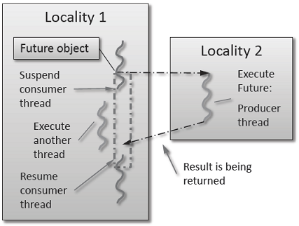

..
    Copyright (C) 2012 Adrian Serio
    Copyright (C) 2012 Vinay C Amatya
    Copyright (C) 2015 Hartmut Kaiser

    SPDX-License-Identifier: BSL-1.0
    Distributed under the Boost Software License, Version 1.0. (See accompanying
    file LICENSE_1_0.txt or copy at http://www.boost.org/LICENSE_1_0.txt)

.. _examples_fibonacci_local:

=====================================================
Asynchronous execution with ``hpx::async``: Fibonacci
=====================================================

The Fibonacci sequence is a sequence of numbers starting with 0 and 1 where
every subsequent number is the sum of the previous two numbers. In this example,
we will use |hpx| to calculate the value of the n-th element of the Fibonacci
sequence. In order to compute this problem in parallel, we will use a facility
known as a future.

As shown in the :numref:`future_schematics` below, a future encapsulates a
delayed computation. It acts as a proxy for a result initially not known, most
of the time because the computation of the result has not completed yet. The
future synchronizes the access of this value by optionally suspending any
|hpx|-threads requesting the result until the value is available. When a future
is created, it spawns a new |hpx|-thread (either remotely with a :term:`parcel`
or locally by placing it into the thread queue) which, when run, will execute
the function associated with the future. The arguments of the function are bound
when the future is created.

.. _future_schematics:

   Schematic of a future execution.

Once the function has finished executing, a write operation is performed on the
future. The write operation marks the future as completed, and optionally stores
data returned by the function. When the result of the delayed computation is
needed, a read operation is performed on the future. If the future's function
hasn't completed when a read operation is performed on it, the reader
|hpx|-thread is suspended until the future is ready. The future facility allows
|hpx| to schedule work early in a program so that when the function value is
needed it will already be calculated and available. We use this property in our
Fibonacci example below to enable its parallel execution.

Setup
=====

The source code for this example can be found here:
:download:`fibonacci_local.cpp <../../examples/quickstart/fibonacci_local.cpp>`.

To compile this program, go to your |hpx| build directory (see
:ref:`hpx_build_system` for information on configuring and building |hpx|) and
enter:

.. code-block:: bash

   make examples.quickstart.fibonacci_local

To run the program type:

.. code-block:: bash

   ./bin/fibonacci_local

This should print (time should be approximate):

.. code-block:: text

    fibonacci(10) == 55
    elapsed time: 0.002430 [s]

This run used the default settings, which calculate the tenth element of the
Fibonacci sequence. To declare which Fibonacci value you want to calculate, use
the ``--n-value`` option. Additionally you can use the :option:`--hpx:threads`
option to declare how many OS-threads you wish to use when running the program.
For instance, running:

.. code-block:: bash

   ./bin/fibonacci --n-value 20 --hpx:threads 4

Will yield:

.. code-block:: text

   fibonacci(20) == 6765
   elapsed time: 0.062854 [s]

Walkthrough
===========

Now that you have compiled and run the code, let's look at how the code works.
Since this code is written in C++, we will begin with the ``main()`` function.
Here you can see that in |hpx|, ``main()`` is only used to initialize the
runtime system. It is important to note that application-specific command line
options are defined here. |hpx| uses |boost_program_options|_ for command line
processing. You can see that our programs ``--n-value`` option is set by calling
the ``add_options()`` method on an instance of
``hpx::program_options::options_description``. The default value of the
variable is set to 10. This is why when we ran the program for the first time
without using the ``--n-value`` option the program returned the 10th value of
the Fibonacci sequence. The constructor argument of the description is the text
that appears when a user uses the :option:`--hpx:help` option to see what
command line options are available. ``HPX_APPLICATION_STRING`` is a macro that
expands to a string constant containing the name of the |hpx| application
currently being compiled.

In |hpx| ``main()`` is used to initialize the runtime system and pass the
command line arguments to the program. If you wish to add command line options
to your program you would add them here using the instance of the Boost class
``options_description``, and invoking the public member function
``.add_options()`` (see |boost_doc|_ for more details). :cpp:func:`hpx::init`
calls ``hpx_main()`` after setting up |hpx|, which is where the logic of our
program is encoded.

.. literalinclude:: ../../examples/quickstart/fibonacci_local.cpp
   :start-after: //[main
   :end-before: //main]

The :cpp:func:`hpx::init` function in ``main()`` starts the runtime system, and
invokes ``hpx_main()`` as the first |hpx|-thread. Below we can see that the
basic program is simple. The command line option ``--n-value`` is read in, a
timer (:cpp:class:`hpx::chrono::high_resolution_timer`) is set up to record the
time it takes to do the computation, the ``fibonacci`` function is invoked
synchronously, and the answer is printed out.

.. literalinclude:: ../../examples/quickstart/fibonacci_local.cpp
   :start-after: //[hpx_main
   :end-before: //hpx_main]

The ``fibonacci`` function itself is synchronous as the work done inside is
asynchronous. To understand what is happening we have to look inside the
``fibonacci`` function:

.. literalinclude:: ../../examples/quickstart/fibonacci_local.cpp
   :start-after: //[fibonacci
   :end-before: //fibonacci]

This block of code looks similar to regular C++ code. First, ``if (n < 2)``,
meaning n is 0 or 1, then we return 0 or 1 (recall the first element of the
Fibonacci sequence is 0 and the second is 1). If n is larger than 1 we spawn two
new tasks whose results are contained in ``n1`` and ``n2``. This is done using
:cpp:func:`hpx::async` which takes as arguments a function (function pointer,
object or lambda) and the arguments to the function. Instead of returning a
``std::uint64_t`` like ``fibonacci`` does, ``hpx::async`` returns a future of a
``std::uint64_t``, i.e. ``hpx::future<std::uint64_t>``. Each of these futures
represents an asynchronous, recursive call to ``fibonacci``. After we've created
the futures, we wait for both of them to finish computing, we add them together,
and return that value as our result. We get the values from the futures using
the ``get`` method. The recursive call tree will continue until n is equal to 0
or 1, at which point the value can be returned because it is implicitly known.
When this termination condition is reached, the futures can then be added up,
producing the n-th value of the Fibonacci sequence.

Note that calling ``get`` potentially blocks the calling |hpx|-thread, and lets
other |hpx|-threads run in the meantime. There are, however, more efficient ways
of doing this. ``examples/quickstart/fibonacci_futures.cpp`` contains many more
variations of locally computing the Fibonacci numbers, where each method makes
different tradeoffs in where asynchrony and parallelism is applied. To get
started, however, the method above is sufficient and optimizations can be
applied once you are more familiar with |hpx|. The example
:ref:`examples_interest_calculator` presents dataflow, which is a way to more
efficiently chain together multiple tasks.
