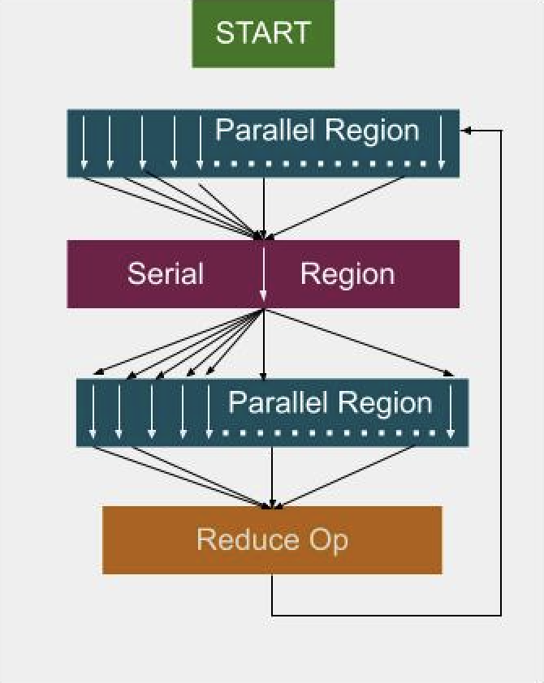
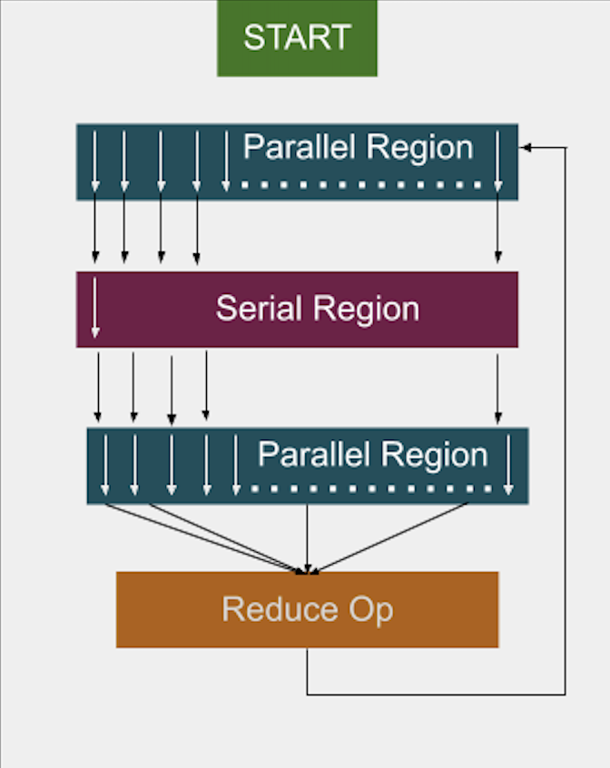
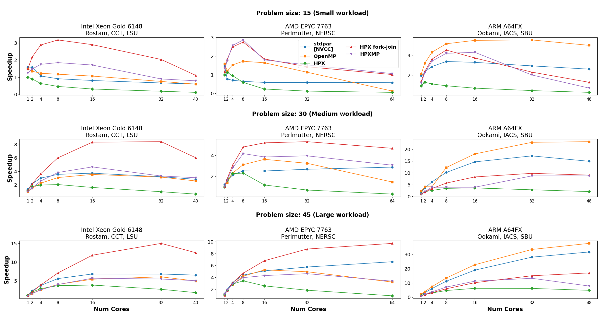

..
    Copyright (c) 2025 Dimitra Karatza

    SPDX-License-Identifier: BSL-1.0
    Distributed under the Boost Software License, Version 1.0. (See accompanying
    file LICENSE_1_0.txt or copy at http://www.boost.org/LICENSE_1_0.txt)

.. _executors:

=========
Executors
=========

Executors in |hpx| provide a flexible way to control **how, when, and where**
tasks are executed. Instead of manually creating threads or managing thread
pools, you can hand your tasks to an executor, and it takes care of the details
of running them.

This page introduces the concept of executors, the main types available in |hpx|,
and how to create custom executors.

.. _executors_intro:

What is an executor?
====================

An **executor** is an abstraction that separates the *what* from the *how* of
task execution:

* **What**: the work to be performed (e.g. a function or task).
* **How**: whether the task runs synchronously, asynchronously, or in parallel
  across multiple cores.

By using executors, you can switch between execution strategies without
rewriting your algorithms. |hpx| provides a rich set of executors with a unified
API.

.. _executors_main:

Main Executors in |hpx|
=======================

|hpx| provides multiple executors. Below are three of the most commonly used:

Parallel Executor
-----------------

* Default in |hpx|.
* Creates a new HPX thread for every scheduled task.
* Works well for large tasks, but frequent small tasks incur overhead due to
  thread creation/destruction.

.. code-block:: c++

    #include <hpx/execution.hpp>
    #include <hpx/parallel/algorithms/for_each.hpp>
    #include <vector>

    std::vector<int> data(100, 1);

    hpx::for_each(
        hpx::execution::par,
        data.begin(), data.end(),
         {
            x += 1;
        }
    );

Fork-Join Executor
------------------

* Spawns one thread per CPU core when created.
* Threads are reused across tasks, avoiding repeated creation costs.
* Efficient for workloads with many sequential parallel regions.
* May waste resources if parallel work is limited.

.. code-block:: c++

    #include <hpx/execution.hpp>
    #include <hpx/parallel/algorithms/for_each.hpp>
    #include <vector>

    std::vector<int> data(100, 1);

    hpx::execution::experimental::fork_join_executor exec;

    hpx::for_each(
        hpx::execution::par.on(exec),
        data.begin(), data.end(),
         {
            x += 1;
        }
    );

Sequential Executor
-------------------

* Executes all tasks synchronously on the calling thread.
* Useful for debugging (deterministic execution) or when parallelism brings no
  benefit.
* Maintains the same executor-based API while running tasks sequentially.

.. code-block:: c++

    #include <hpx/execution.hpp>
    #include <hpx/parallel/algorithms/for_each.hpp>
    #include <vector>

    std::vector<int> data(100, 1);

    hpx::execution::sequenced_executor seq_exec;

    hpx::for_each(
        hpx::execution::seq.on(seq_exec),
        data.begin(), data.end(),
         { x += 1; }
    );

.. _executors_real_world:

Executors in real-world applications
====================================

A practical example is the **LULESH** mini-application (a hydrodynamics
benchmark).

.. _parallel_executor:

   Parallel executor: creates and destroys threads for each loop.

.. _fork_join_executor:

   Fork-join executor: reuses threads across loops.

* With the **parallel executor**, each parallel loop creates and destroys new
  threads, introducing overhead.
* With the **fork-join executor**, threads are created once and reused across
  loops, reducing overhead and improving performance.

In studies, the fork-join executor achieved significant speedups, in some cases
more than twice as fast as traditional OpenMP implementations.

.. _executor_performance_comparison:

   Performance comparison between executors in the LULESH benchmark.

.. _executors_custom:

Custom executors
================

While |hpx| provides a variety of built-in executors, you may sometimes need to
adapt task execution to your own requirements. This is where **custom
executors** come in. By writing a small wrapper around an existing executor, you
can extend its behavior—for example, to add logging, profiling information, or
special scheduling rules—while still taking advantage of the |hpx| executor API.

Custom annotating executor
--------------------------

The following example shows how to implement a simple executor that annotates
tasks with a string label for easier debugging and profiling.

.. note::

    Annotations do not affect how tasks run or what results they produce. Their
    main purpose is to give human-readable names to tasks so that they can be
    identified in profilers, and debuggers.

Full example code
^^^^^^^^^^^^^^^^^

.. code-block:: c++

    #include <hpx/hpx_main.hpp>
    #include <hpx/include/parallel_executors.hpp>
    #include <hpx/include/async.hpp>
    #include <hpx/execution.hpp>
    #include <hpx/async_base/post.hpp>
    #include <hpx/threading_base/annotated_function.hpp>

    #include <iostream>
    #include <string>
    #include <utility>

    template <typename BaseExecutor>
    struct simple_annotating_executor
    {
        BaseExecutor base_;
        const char* annotation_;

        simple_annotating_executor(BaseExecutor exec, const char* ann)
            : base_(std::move(exec)), annotation_(ann)
        {}

        // Non-blocking one-way executor
        template <typename F, typename... Ts>
        friend void tag_invoke(hpx::parallel::execution::post_t,
                            simple_annotating_executor const& exec,
                            F&& f, Ts&&... ts)
        {
            hpx::post(
                hpx::annotated_function(std::forward<F>(f), exec.annotation_),
                std::forward<Ts>(ts)...);
        }

        // Synchronous execution
        template <typename F, typename... Ts>
        friend auto tag_invoke(hpx::parallel::execution::sync_execute_t,
                            simple_annotating_executor const& exec,
                            F&& f, Ts&&... ts)
        {
            return hpx::parallel::execution::sync_execute(
                exec.base_,
                hpx::annotated_function(std::forward<F>(f), exec.annotation_),
                std::forward<Ts>(ts)...);
        }
    };

    // Example functions
    int compute_square(int x)
    {
        std::cout << "[sync_execute] Running task with annotation\n";
        return x * x;
    }

    void say_hello()
    {
        std::cout << "[post] Running task with annotation\n";
    }

    int main()
    {
        simple_annotating_executor exec(hpx::execution::parallel_executor{}, "my_custom_task");

        // Synchronous execution
        int result = hpx::parallel::execution::sync_execute(exec, &compute_square, 7);
        std::cout << "Result from sync_execute: " << result << "\n";

        // Post a task
        hpx::parallel::execution::post(exec, &say_hello);

        return 0;
    }

Explanation
^^^^^^^^^^^

The first lines pull in the necessary HPX headers for executors, asynchronous
execution, and annotated functions. The key one here is
`hpx/threading_base/annotated_function.hpp`, which provides the facility to tag
tasks with a string label. We then define a simple_annotating_executor
that wraps another executor and associates an annotation string with every task:

.. code-block:: c++

    template <typename BaseExecutor>
    struct simple_annotating_executor
    {
        BaseExecutor base_;
        const char* annotation_;

        simple_annotating_executor(BaseExecutor exec, const char* ann)
            : base_(std::move(exec)), annotation_(ann)
        {}
    };

The post customization schedules a task to run asynchronously. We wrap the
task in `hpx::annotated_function` so that it carries the annotation.
Executors in HPX customize these operations through `tag_invoke` overloads,
which are selected by special tag objects like `post_t`` and `sync_execute_t`.
This is why the executor interface may look different from a normal member
function API.

.. code-block:: c++

    template <typename F, typename... Ts>
    friend void tag_invoke(hpx::parallel::execution::post_t,
                        simple_annotating_executor const& exec,
                        F&& f, Ts&&... ts)
    {
        hpx::post(
            hpx::annotated_function(std::forward<F>(f), exec.annotation_),
            std::forward<Ts>(ts)...);
    }

The `sync_execute` customization runs a task immediately and returns the
result. Again, we wrap the function with an annotation before executing.
The key difference is that `post` schedules a task in a fire-and-forget style
(no result is returned), while `sync_execute` blocks until the task finishes
and gives you the result back.

.. code-block:: c++

    template <typename F, typename... Ts>
    friend auto tag_invoke(hpx::parallel::execution::sync_execute_t,
                        simple_annotating_executor const& exec,
                        F&& f, Ts&&... ts)
    {
        return hpx::parallel::execution::sync_execute(
            exec.base_,
            hpx::annotated_function(std::forward<F>(f), exec.annotation_),
            std::forward<Ts>(ts)...);
    }

Note how we delegate the actual execution to `exec.base_`, the underlying
executor. This makes the custom executor lightweight: it only adds annotations,
while leaving the scheduling strategy to the base executor (here, a
`parallel_executor`).

We define two simple functions to demonstrate both synchronous and asynchronous
execution:
These functions also print to `std::cout`, but this output is not the actual
annotation. Annotations are stored internally by HPX and become visible when you
use debugging or profiling tools.

.. code-block:: c++

    int compute_square(int x)
    {
        std::cout << "[sync_execute] Running task with annotation\n";
        return x * x;
    }

    void say_hello()
    {
        std::cout << "[post] Running task with annotation\n";
    }

Finally, in main we create the executor with a base executor and annotation
string. We then run one task with sync_execute (blocking, returns result)
and one with post (asynchronous, fire-and-forget).
You can also create multiple annotating executors with different strings, so
each task gets its own label. This is especially useful in larger applications
with many different kinds of tasks, where annotations make it much easier to
trace what is happening.

.. code-block:: c++

    int main()
    {
        simple_annotating_executor exec(hpx::execution::parallel_executor{}, "my_custom_task");

        // Synchronous execution
        int result = hpx::parallel::execution::sync_execute(exec, &compute_square, 7);
        std::cout << "Result from sync_execute: " << result << "\n";

        // Post a task
        hpx::parallel::execution::post(exec, &say_hello);

        return 0;
    }

Custom annotating executor with parallel algorithms
---------------------------------------------------

The following example demonstrates how to use a custom annotating executor with
|hpx| parallel algorithms, such as `for_each`.
This allows you to attach annotations to tasks while executing them in parallel.

Full example code
^^^^^^^^^^^^^^^^^

.. code-block:: c++

    #include <hpx/execution.hpp>
    #include <hpx/hpx_main.hpp>
    #include <hpx/include/parallel_algorithm.hpp>
    #include <hpx/include/parallel_executors.hpp>
    #include <hpx/threading_base/annotated_function.hpp>

    #include <iostream>
    #include <utility>
    #include <vector>

    template <typename BaseExecutor>
    struct simple_annotating_executor
    {
        BaseExecutor base_;
        char const* annotation_;

        using execution_category =
            hpx::traits::executor_execution_category_t<BaseExecutor>;

        simple_annotating_executor(BaseExecutor exec, char const* ann)
        : base_(std::move(exec))
        , annotation_(ann)
        {
        }

        // Bulk async_execute (used by parallel algorithms)
        template <typename F, typename Shape, typename... Ts>
        friend auto tag_invoke(hpx::parallel::execution::bulk_async_execute_t,
            simple_annotating_executor const& exec, F&& f, Shape const& shape,
            Ts&&... ts)
        {
            return hpx::parallel::execution::bulk_async_execute(
                exec.base_,
                hpx::annotated_function(std::forward<F>(f), exec.annotation_),
                shape, std::forward<Ts>(ts)...);
        }
    };

    namespace hpx::execution::experimental {

        // The annotating executor exposes the same executor categories as its
        // underlying (wrapped) executor.

        template <typename BaseExecutor>
        struct is_never_blocking_one_way_executor<
            simple_annotating_executor<BaseExecutor>>
        : is_never_blocking_one_way_executor<BaseExecutor>
        {
        };

        template <typename BaseExecutor>
        struct is_one_way_executor<simple_annotating_executor<BaseExecutor>>
        : is_one_way_executor<BaseExecutor>
        {
        };

        template <typename BaseExecutor>
        struct is_two_way_executor<simple_annotating_executor<BaseExecutor>>
        : is_two_way_executor<BaseExecutor>
        {
        };
    }    // namespace hpx::execution::experimental

    int main()
    {
        using base_executor = hpx::execution::parallel_executor;
        simple_annotating_executor exec(base_executor{}, "for_each_task");

        std::vector<int> data = {1, 2, 3, 4, 5};

        // Use the custom executor with a parallel algorithm
        hpx::for_each(hpx::execution::par.on(exec),    // attach executor
            data.begin(), data.end(),  {
                std::cout << "Processing " << x << " on thread "
                        << hpx::get_worker_thread_num() << "\n";
                x *= x;
            });

        std::cout << "Squared values: ";
        for (int v : data)
            std::cout << v << " ";
        std::cout << "\n";

        return 0;
    }

Explanation
^^^^^^^^^^^

Similar as before, the first lines pull in the necessary HPX headers for executors,
asynchronous execution, and annotated functions. The key one here is
`hpx/threading_base/annotated_function.hpp`, which provides the facility to tag
tasks with a string label. We then define a simple_annotating_executor
that wraps another executor and associates an annotation string with every task:

.. code-block:: c++

    template <typename BaseExecutor>
    struct simple_annotating_executor
    {
        BaseExecutor base_;
        const char* annotation_;

        using execution_category =
            hpx::traits::executor_execution_category_t<BaseExecutor>;

        simple_annotating_executor(BaseExecutor exec, const char* ann)
            : base_(std::move(exec)), annotation_(ann)
        {}
    };

Note that we expose the execution category of the custom executor with
`using execution_category = hpx::traits::executor_execution_category_t<BaseExecutor>`.
We inherit the execution category from the underlying executor (`BaseExecutor``), which
ensures that our `simple_annotating_executor` behaves like the base executor in terms of
parallelism and task execution capabilities.

The `bulk_async_execute` customization schedules a set of tasks to run asynchronously.
We wrap each task in `hpx::annotated_function` so that it carries the annotation.
Executors in |hpx| customize these operations through `tag_invoke` overloads, which are
selected by special tag objects like `bulk_async_execute_t`. This is why the executor
interface may look different from a normal member function API - it uses tag dispatch
to integrate seamlessly with the |hpx| parallel algorithms infrastructure.

.. code-block:: c++

    template <typename F, typename Shape, typename... Ts>
    friend auto tag_invoke(hpx::parallel::execution::bulk_async_execute_t,
        simple_annotating_executor const& exec, F&& f, Shape const& shape,
        Ts&&... ts)
    {
        return hpx::parallel::execution::bulk_async_execute(
            exec.base_,
            hpx::annotated_function(std::forward<F>(f), exec.annotation_),
            shape, std::forward<Ts>(ts)...);
    }

Note how we delegate the actual execution to `exec.base_`, the underlying
executor. This makes the custom executor lightweight: it only adds annotations,
while leaving the scheduling strategy to the base executor (here, a
`parallel_executor`).

The `hpx::execution::experimental` namespace contains traits that describe executor capabilities,
such as whether an executor can run tasks one-way, two-way, or never-blocking.
These traits are used internally by |hpx| to verify that an executor is compatible with
a given parallel algorithm or execution policy.

.. code-block:: c++

    namespace hpx::execution::experimental {

        // The annotating executor exposes the same executor categories as its
        // underlying (wrapped) executor.

        template <typename BaseExecutor>
        struct is_never_blocking_one_way_executor<
            simple_annotating_executor<BaseExecutor>>
        : is_never_blocking_one_way_executor<BaseExecutor>
        {
        };

        template <typename BaseExecutor>
        struct is_one_way_executor<simple_annotating_executor<BaseExecutor>>
        : is_one_way_executor<BaseExecutor>
        {
        };

        template <typename BaseExecutor>
        struct is_two_way_executor<simple_annotating_executor<BaseExecutor>>
        : is_two_way_executor<BaseExecutor>
        {
        };
    }

* `is_never_blocking_one_way_executor` indicates whether the executor can schedule tasks in a fire-and-forget style without blocking.
* `is_one_way_executor` indicates support for one-way execution (tasks can be scheduled but no result is returned).
* `is_two_way_executor` indicates support for two-way execution (tasks return a result or a future).
In all cases, the custom executor inherits the capabilities of the base executor, so it integrates seamlessly with |hpx| algorithms.

This design ensures that `simple_annotating_executor` can be used anywhere its underlying executor could be used, while still
adding the annotation functionality. It keeps the custom executor lightweight and fully compatible with the parallel algorithms
infrastructure.

In main, we create the executor with a base executor and an annotation string,
and then use it with a parallel algorithm:

.. code-block:: c++

    int main()
    {
        using base_executor = hpx::execution::parallel_executor;
        simple_annotating_executor exec(base_executor{}, "for_each_task");

        std::vector<int> data = {1, 2, 3, 4, 5};

        // Use the custom executor with a parallel algorithm
        hpx::for_each(hpx::execution::par.on(exec),    // attach executor
            data.begin(), data.end(),  {
                std::cout << "Processing " << x << " on thread "
                        << hpx::get_worker_thread_num() << "\n";
                x *= x;
            });

        std::cout << "Squared values: ";
        for (int v : data)
            std::cout << v << " ";
        std::cout << "\n";

        return 0;
    }

First, we create a base executor (`parallel_executor`) and wrap it in our `simple_annotating_executor`,
providing an annotation string "for_each_task". This custom executor will attach the annotation to every
task it schedules, while delegating actual execution to the base executor.

We then use hpx::for_each with a parallel execution policy and attach our custom executor using `par.on(exec)`:
* hpx::execution::par.on(exec) attaches our custom executor to the algorithm.
* for_each internally partitions the work across threads and schedules each task using `bulk_async_execute`.
* Each task is annotated with "for_each_task", visible in debuggers and profilers.
* The results of the parallel computation are stored in the data vector, demonstrating that the algorithm
  executed successfully in parallel.

This pattern is especially useful in larger applications with many tasks, as annotations make it much easier
to trace and debug the execution of parallel algorithms.
