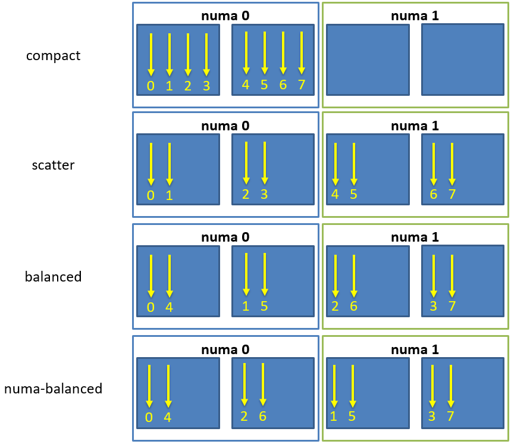

..
    Copyright (C) 2007-2015 Hartmut Kaiser
    Copyright (C) 2011-2012 Bryce Adelstein-Lelbach

    SPDX-License-Identifier: BSL-1.0
    Distributed under the Boost Software License, Version 1.0. (See accompanying
    file LICENSE_1_0.txt or copy at http://www.boost.org/LICENSE_1_0.txt)

.. _launching_and_configuring:

============================================
Launching and configuring |hpx| applications
============================================

.. _configuration:

Configuring |hpx| applications
==============================

All |hpx| applications can be configured using special command line options
and/or using special configuration files. This section describes the available
options, the configuration file format, and the algorithm used to locate
possible predefined configuration files. Additionally this section describes the
defaults assumed if no external configuration information is supplied.

During startup any |hpx| application applies a predefined search pattern to
locate one or more configuration files. All found files will be read and merged
in the sequence they are found into one single internal database holding all
configuration properties. This database is used during the execution of the
application to configure different aspects of the runtime system.

In addition to the ini files, any application can supply its own configuration
files, which will be merged with the configuration database as well. Moreover,
the user can specify additional configuration parameters on the command line
when executing an application. The |hpx| runtime system will merge all command
line configuration options (see the description of the :option:`--hpx:ini`,
:option:`--hpx:config`, and :option:`--hpx:app-config` command line options).

.. _ini_format:

The |hpx| INI File Format
-------------------------

All |hpx| applications can be configured using a special file format which is
similar to the well-known |ini_file_format|_. This is a structured text format
allowing to group key/value pairs (properties) into sections. The basic element
contained in an ini file is the property. Every property has a name and a
value, delimited by an equals sign ``'='``. The name appears to the left of the
equals sign:

.. code-block:: ini

   name=value

The value may contain equal signs as only the first ``'='`` character
is interpreted as the delimiter between ``name`` and ``value`` Whitespace before
the name, after the value and immediately before and after the delimiting equal
sign is ignored. Whitespace inside the value is retained.

Properties may be grouped into arbitrarily named sections. The section name
appears on a line by itself, in square brackets ``[`` and ``]``. All properties
after the section declaration are associated with that section. There is no
explicit "end of section" delimiter; sections end at the next section
declaration, or the end of the file:

.. code-block:: ini

   [section]

In |hpx| sections can be nested. A nested section has a name composed of
all section names it is embedded in. The section names are concatenated using
a dot ``'.'``:

.. code-block:: ini

   [outer_section.inner_section]

Here ``inner_section`` is logically nested within ``outer_section``.

It is possible to use the full section name concatenated with the property
name to refer to a particular property. For example in:

.. code-block:: ini

    [a.b.c]
    d = e

the property value of ``d`` can be referred to as ``a.b.c.d=e``.

In |hpx| ini files can contain comments. Hash signs ``'#'`` at the beginning
of a line indicate a comment. All characters starting with the ``'#'`` until the
end of line are ignored.

If a property with the same name is reused inside a section, the second
occurrence of this property name will override the first occurrence (discard the
first value). Duplicate sections simply merge their properties together, as if
they occurred contiguously.

In |hpx| ini files, a property value ``${FOO:default}`` will use the environmental
variable ``FOO`` to extract the actual value if it is set and ``default`` otherwise.
No default has to be specified. Therefore ``${FOO}`` refers to the environmental
variable ``FOO``. If ``FOO`` is not set or empty the overall expression will evaluate
to an empty string. A property value ``$[section.key:default]`` refers to the value
held by the property ``section.key`` if it exists and ``default`` otherwise. No
default has to be specified. Therefore ``$[section.key]`` refers to the property
``section.key``. If the property ``section.key`` is not set or empty, the overall
expression will evaluate to an empty string.

.. note::

   Any property ``$[section.key:default]`` is evaluated whenever it is queried
   and not when the configuration data is initialized. This allows for lazy
   evaluation and relaxes initialization order of different sections. The only
   exception are recursive property values, e.g. values referring to the very
   key they are associated with. Those property values are evaluated at
   initialization time to avoid infinite recursion.

.. _config_defaults:

Built-in Default Configuration Settings
---------------------------------------

During startup any |hpx| application applies a predefined search pattern to
locate one or more configuration files. All found files will be read and merged
in the sequence they are found into one single internal data structure holding
all configuration properties.

As a first step the internal configuration database is filled with a set of
default configuration properties. Those settings are described on a section
by section basis below.

.. note::

   You can print the default configuration settings used for an executable
   by specifying the command line option :option:`--hpx:dump-config`.

The ``system`` configuration section
....................................

.. code-block:: ini

   [system]
   pid = <process-id>
   prefix = <current prefix path of core HPX library>
   executable = <current prefix path of executable>

.. _ini_system:

.. list-table::

   * * Property
     * Description
   * * ``system.pid``
     * This is initialized to store the current OS-process id of the application
       instance.
   * * ``system.prefix``
     * This is initialized to the base directory |hpx| has been loaded from.
   * * ``system.executable_prefix``
     * This is initialized to the base directory the current executable has been
       loaded from.

The ``hpx`` configuration section
.................................

.. code-block:: ini

   [hpx]
   location = ${HPX_LOCATION:$[system.prefix]}
   component_path = $[hpx.location]/lib/hpx:$[system.executable_prefix]/lib/hpx:$[system.executable_prefix]/../lib/hpx
   master_ini_path = $[hpx.location]/share/hpx-<version>:$[system.executable_prefix]/share/hpx-<version>:$[system.executable_prefix]/../share/hpx-<version>
   ini_path = $[hpx.master_ini_path]/ini
   os_threads = 1
   localities = 1
   program_name =
   cmd_line =
   lock_detection = ${HPX_LOCK_DETECTION:0}
   throw_on_held_lock = ${HPX_THROW_ON_HELD_LOCK:1}
   minimal_deadlock_detection = <debug>
   spinlock_deadlock_detection = <debug>
   spinlock_deadlock_detection_limit = ${HPX_SPINLOCK_DEADLOCK_DETECTION_LIMIT:1000000}
   max_background_threads = ${HPX_MAX_BACKGROUND_THREADS:$[hpx.os_threads]}
   max_idle_loop_count = ${HPX_MAX_IDLE_LOOP_COUNT:<hpx_idle_loop_count_max>}
   max_busy_loop_count = ${HPX_MAX_BUSY_LOOP_COUNT:<hpx_busy_loop_count_max>}
   max_idle_backoff_time = ${HPX_MAX_IDLE_BACKOFF_TIME:<hpx_idle_backoff_time_max>}
   exception_verbosity = ${HPX_EXCEPTION_VERBOSITY:2}

   [hpx.stacks]
   small_size = ${HPX_SMALL_STACK_SIZE:<hpx_small_stack_size>}
   medium_size = ${HPX_MEDIUM_STACK_SIZE:<hpx_medium_stack_size>}
   large_size = ${HPX_LARGE_STACK_SIZE:<hpx_large_stack_size>}
   huge_size = ${HPX_HUGE_STACK_SIZE:<hpx_huge_stack_size>}
   use_guard_pages = ${HPX_THREAD_GUARD_PAGE:1}

.. _ini_hpx:

.. list-table::

   * * Property
     * Description
   * * ``hpx.location``
     * This is initialized to the id of the :term:`locality` this application
       instance is running on.
   * * ``hpx.component_path``
     * Duplicates are discarded.
       This property can refer to a list of directories separated by ``':'``
       (Linux, Android, and MacOS) or using ``';'`` (Windows).
   * * ``hpx.master_ini_path``
     * This is initialized to the list of default paths of the main hpx.ini
       configuration files. This property can refer to a list of directories
       separated by ``':'`` (Linux, Android, and MacOS) or using ``';'``
       (Windows).
   * * ``hpx.ini_path``
     * This is initialized to the default path where |hpx| will look for more
       ini configuration files. This property can refer to a list of directories
       separated by ``':'`` (Linux, Android, and MacOS) or using ``';'``
       (Windows).
   * * ``hpx.os_threads``
     * This setting reflects the number of OS-threads used for running
       |hpx|-threads. Defaults to number of detected cores (not hyperthreads/PUs).
   * * ``hpx.localities``
     * This setting reflects the number of localities the application is running
       on. Defaults to ``1``.
   * * ``hpx.program_name``
     * This setting reflects the program name of the application instance.
       Initialized from the command line ``argv[0]``.
   * * ``hpx.cmd_line``
     * This setting reflects the actual command line used to launch this
       application instance.
   * * ``hpx.lock_detection``
     * This setting verifies that no locks are being held while a |hpx| thread
       is suspended. This setting is applicable only if
       ``HPX_WITH_VERIFY_LOCKS`` is set during configuration in CMake.
   * * ``hpx.throw_on_held_lock``
     * This setting causes an exception if during lock detection at least one
       lock is being held while a |hpx| thread is suspended. This setting is
       applicable only if ``HPX_WITH_VERIFY_LOCKS`` is set during configuration
       in CMake. This setting has no effect if ``hpx.lock_detection=0``.
   * * ``hpx.minimal_deadlock_detection``
     * This setting enables support for minimal deadlock detection for
       |hpx|-threads. By default this is set to ``1`` (for Debug builds) or to
       ``0`` (for Release, RelWithDebInfo, RelMinSize builds), this setting is
       effective only if ``HPX_WITH_THREAD_DEADLOCK_DETECTION`` is set during
       configuration in CMake.
   * * ``hpx.spinlock_deadlock_detection``
     * This setting verifies that spinlocks don't spin longer than specified
       using the ``hpx.spinlock_deadlock_detection_limit``. This setting is
       applicable only if ``HPX_WITH_SPINLOCK_DEADLOCK_DETECTION`` is set during
       configuration in CMake. By default this is set to ``1`` (for Debug
       builds) or to ``0`` (for Release, RelWithDebInfo, RelMinSize builds).
   * * ``hpx.spinlock_deadlock_detection_limit``
     * This setting specifies the upper limit of allowed number of spins that
       spinlocks are allowed to perform. This setting is applicable only if
       ``HPX_WITH_SPINLOCK_DEADLOCK_DETECTION`` is set during configuration in
       CMake. By default this is set to ``1000000``.
   * * ``hpx.max_background_threads``
     * This setting defines the number of threads in the scheduler which are
       used to execute background work. By default this is the same as the
       number of cores used for the scheduler.
   * * ``hpx.max_idle_loop_count``
     * By default this is defined by the preprocessor constant
       ``HPX_IDLE_LOOP_COUNT_MAX``. This is an internal setting which you should
       change only if you know exactly what you are doing.
   * * ``hpx.max_busy_loop_count``
     * This setting defines the maximum value of the busy-loop counter in the
       scheduler. By default this is defined by the preprocessor constant
       ``HPX_BUSY_LOOP_COUNT_MAX``. This is an internal setting which you should
       change only if you know exactly what you are doing.
   * * ``hpx.max_idle_backoff_time``
     * This setting defines the maximum time (in milliseconds) for the scheduler
       to sleep after being idle for ``hpx.max_idle_loop_count`` iterations.
       This setting is applicable only if
       ``HPX_WITH_THREAD_MANAGER_IDLE_BACKOFF`` is set during configuration in
       |cmake|. By default this is defined by the preprocessor constant
       ``HPX_IDLE_BACKOFF_TIME_MAX``. This is an internal setting which you
       should change only if you know exactly what you are doing.
   * * ``hpx.exception_verbosity``
     * This setting defines the verbosity of exceptions. Valid values are
       integers. A setting of ``2`` or higher prints all available information.
       A setting of ``1`` leaves out the build configuration and environment
       variables. A setting of ``0`` or lower prints only the description of the
       thrown exception and the file name, function, and line number where the
       exception was thrown. The default value is ``2`` or the value of the
       environment variable ``HPX_EXCEPTION_VERBOSITY``.
   * * ``hpx.stacks.small_size``
     * This is initialized to the small stack size to be used by |hpx|-threads.
       Set by default to the value of the compile time preprocessor constant
       ``HPX_SMALL_STACK_SIZE`` (defaults to ``0x8000``). This value is used for
       all |hpx| threads by default, except for the thread running ``hpx_main``
       (which runs on a large stack).
   * * ``hpx.stacks.medium_size``
     * This is initialized to the medium stack size to be used by |hpx|-threads.
       Set by default to the value of the compile time preprocessor constant
       ``HPX_MEDIUM_STACK_SIZE`` (defaults to ``0x20000``).
   * * ``hpx.stacks.large_size``
     * This is initialized to the large stack size to be used by |hpx|-threads.
       Set by default to the value of the compile time preprocessor constant
       ``HPX_LARGE_STACK_SIZE`` (defaults to ``0x200000``). This setting is used
       by default for the thread running ``hpx_main`` only.
   * * ``hpx.stacks.huge_size``
     * This is initialized to the huge stack size to be used by |hpx|-threads.
       Set by default to the value of the compile time preprocessor constant
       ``HPX_HUGE_STACK_SIZE`` (defaults to ``0x2000000``).
   * * ``hpx.stacks.use_guard_pages``
     * This entry controls whether the coroutine library will generate stack
       guard pages or not. This entry is applicable on Linux only and only if
       the ``HPX_USE_GENERIC_COROUTINE_CONTEXT`` option is not enabled and the
       ``HPX_WITH_THREAD_GUARD_PAGE`` is set to 1 while configuring the build
       system. It is set by default to ``1``.

The ``hpx.threadpools`` configuration section
.............................................

.. code-block:: ini

   [hpx.threadpools]
   io_pool_size = ${HPX_NUM_IO_POOL_SIZE:2}
   parcel_pool_size = ${HPX_NUM_PARCEL_POOL_SIZE:2}
   timer_pool_size = ${HPX_NUM_TIMER_POOL_SIZE:2}

.. _ini_hpx_thread_pools:

.. list-table::

   * * Property
     * Description
   * * ``hpx.threadpools.io_pool_size``
     * The value of this property defines the number of OS-threads created for
       the internal I/O thread pool.
   * * ``hpx.threadpools.parcel_pool_size``
     * The value of this property defines the number of OS-threads created for
       the internal parcel thread pool.
   * * ``hpx.threadpools.timer_pool_size``
     * The value of this property defines the number of OS-threads created for
       the internal timer thread pool.

The ``hpx.thread_queue`` configuration section
..............................................

.. important::

   These setting control internal values used by the thread scheduling queues in
   the |hpx| scheduler. You should not modify these settings except if you know
   exactly what you are doing]

.. code-block:: ini

   [hpx.thread_queue]
   min_tasks_to_steal_pending = ${HPX_THREAD_QUEUE_MIN_TASKS_TO_STEAL_PENDING:0}
   min_tasks_to_steal_staged = ${HPX_THREAD_QUEUE_MIN_TASKS_TO_STEAL_STAGED:10}
   min_add_new_count = ${HPX_THREAD_QUEUE_MIN_ADD_NEW_COUNT:10}
   max_add_new_count = ${HPX_THREAD_QUEUE_MAX_ADD_NEW_COUNT:10}
   max_delete_count = ${HPX_THREAD_QUEUE_MAX_DELETE_COUNT:1000}

.. _ini_hpx_thread_queue:

.. list-table::

   * * Property
     * Description
   * * ``hpx.thread_queue.min_tasks_to_steal_pending``
     * The value of this property defines the number of pending |hpx| threads
       which have to be available before neighboring cores are allowed to steal
       work. The default is to allow stealing always.
   * * ``hpx.thread_queue.min_tasks_to_steal_staged``
     * The value of this property defines the number of staged |hpx| tasks have
       which to be available before neighboring cores are allowed to steal work.
       The default is to allow stealing only if there are more tan 10 tasks
       available.
   * * ``hpx.thread_queue.min_add_new_count``
     * The value of this property defines the minimal number tasks to be
       converted into |hpx| threads whenever the thread queues for a core have
       run empty.
   * * ``hpx.thread_queue.max_add_new_count``
     * The value of this property defines the maximal number tasks to be
       converted into |hpx| threads whenever the thread queues for a core have
       run empty.
   * * ``hpx.thread_queue.max_delete_count``
     * The value of this property defines the number of terminated |hpx| threads
       to discard during each invocation of the corresponding function.

The ``hpx.components`` configuration section
............................................

.. code-block:: ini

    [hpx.components]
    load_external = ${HPX_LOAD_EXTERNAL_COMPONENTS:1}

.. _ini_hpx_components:

.. list-table::

   * * Property
     * Description
   * * ``hpx.components.load_external``
     * This entry defines whether external components will be loaded on this
       :term:`locality`. This entry normally is set to ``1`` and usually there is
       no need to directly change this value. It is automatically set to ``0`` for
       a dedicated :term:`AGAS` server :term:`locality`.

Additionally, the section ``hpx.components`` will be populated with the
information gathered from all found components. The information loaded for each
of the components will contain at least the following properties:

.. code-block:: ini

    [hpx.components.<component_instance_name>]
    name = <component_name>
    path = <full_path_of_the_component_module>
    enabled = $[hpx.components.load_external]

.. _ini_hpx_components_custom:

.. list-table::

   * * Property
     * Description
   * * ``hpx.components.<component_instance_name>.name``
     * This is the name of a component, usually the same as the second argument
       to the macro used while registering the component with
       :c:macro:`HPX_REGISTER_COMPONENT`. Set by the component factory.
   * * ``hpx.components.<component_instance_name>.path``
     * This is either the full path file name of the component module or the
       directory the component module is located in. In this case, the component
       module name will be derived from the property
       ``hpx.components.<component_instance_name>.name``. Set by the component
       factory.
   * * ``hpx.components.<component_instance_name>.enabled``
     * This setting explicitly enables or disables the component. This is an
       optional property, |hpx| assumed that the component is enabled if it is
       not defined.

The value for ``<component_instance_name>`` is usually the same as for the
corresponding ``name`` property. However generally it can be defined to any
arbitrary instance name. It is used to distinguish between different ini
sections, one for each component.

The ``hpx.parcel`` configuration section
........................................

.. code-block:: ini

    [hpx.parcel]
    address = ${HPX_PARCEL_SERVER_ADDRESS:<hpx_initial_ip_address>}
    port = ${HPX_PARCEL_SERVER_PORT:<hpx_initial_ip_port>}
    bootstrap = ${HPX_PARCEL_BOOTSTRAP:<hpx_parcel_bootstrap>}
    max_connections = ${HPX_PARCEL_MAX_CONNECTIONS:<hpx_parcel_max_connections>}
    max_connections_per_locality = ${HPX_PARCEL_MAX_CONNECTIONS_PER_LOCALITY:<hpx_parcel_max_connections_per_locality>}
    max_message_size = ${HPX_PARCEL_MAX_MESSAGE_SIZE:<hpx_parcel_max_message_size>}
    max_outbound_message_size = ${HPX_PARCEL_MAX_OUTBOUND_MESSAGE_SIZE:<hpx_parcel_max_outbound_message_size>}
    array_optimization = ${HPX_PARCEL_ARRAY_OPTIMIZATION:1}
    zero_copy_optimization = ${HPX_PARCEL_ZERO_COPY_OPTIMIZATION:$[hpx.parcel.array_optimization]}
    async_serialization = ${HPX_PARCEL_ASYNC_SERIALIZATION:1}
    message_handlers = ${HPX_PARCEL_MESSAGE_HANDLERS:0}

.. _ini_hpx_parcel:

.. list-table::

   * * Property
     * Description
   * * ``hpx.parcel.address``
     * This property defines the default IP address to be used for the :term:`parcel`
       layer to listen to. This IP address will be used as long as no other
       values are specified (for instance using the :option:`--hpx:hpx` command
       line option). The expected format is any valid IP address or domain name
       format which can be resolved into an IP address. The default depends on
       the compile time preprocessor constant ``HPX_INITIAL_IP_ADDRESS``
       (``"127.0.0.1"``).
   * * ``hpx.parcel.port``
     * This property defines the default IP port to be used for the :term:`parcel` layer
       to listen to. This IP port will be used as long as no other values are
       specified (for instance using the :option:`--hpx:hpx` command line
       option). The default depends on the compile time preprocessor
       constant ``HPX_INITIAL_IP_PORT`` (``7910``).
   * * ``hpx.parcel.bootstrap``
     * This property defines which parcelport type should be used during
       application bootstrap. The default depends on the compile time
       preprocessor constant ``HPX_PARCEL_BOOTSTRAP`` (``"tcp"``).
   * * ``hpx.parcel.max_connections``
     * This property defines how many network connections between different
       localities are overall kept alive by each of :term:`locality`. The
       default depends on the compile time preprocessor constant
       ``HPX_PARCEL_MAX_CONNECTIONS`` (``512``).
   * * ``hpx.parcel.max_connections_per_locality``
     * This property defines the maximum number of network connections that one
       :term:`locality` will open to another :term:`locality`. The default depends
       on the compile time preprocessor constant
       ``HPX_PARCEL_MAX_CONNECTIONS_PER_LOCALITY`` (``4``).
   * * ``hpx.parcel.max_message_size``
     * This property defines the maximum allowed message size which will be
       transferable through the :term:`parcel` layer. The default depends on the
       compile time preprocessor constant ``HPX_PARCEL_MAX_MESSAGE_SIZE``
       (``1000000000`` bytes).
   * * ``hpx.parcel.max_outbound_message_size``
     * This property defines the maximum allowed outbound coalesced message size
       which will be transferable through the parcel layer. The default depends
       on the compile time preprocessor constant
       ``HPX_PARCEL_MAX_OUTBOUND_MESSAGE_SIZE`` (``1000000`` bytes).
   * * ``hpx.parcel.array_optimization``
     * This property defines whether this :term:`locality` is allowed to utilize
       array optimizations during serialization of :term:`parcel` data. The default is
       ``1``.
   * * ``hpx.parcel.zero_copy_optimization``
     * This property defines whether this :term:`locality` is allowed to utilize
       zero copy optimizations during serialization of :term:`parcel` data. The default
       is the same value as set for ``hpx.parcel.array_optimization``.
   * * ``hpx.parcel.async_serialization``
     * This property defines whether this :term:`locality` is allowed to spawn a
       new thread for serialization (this is both for encoding and decoding
       parcels). The default is ``1``.
   * * ``hpx.parcel.message_handlers``
     * This property defines whether message handlers are loaded. The default is
       ``0``.

The following settings relate to the TCP/IP parcelport.

.. code-block:: ini

   [hpx.parcel.tcp]
   enable = ${HPX_HAVE_PARCELPORT_TCP:$[hpx.parcel.enabled]}
   array_optimization = ${HPX_PARCEL_TCP_ARRAY_OPTIMIZATION:$[hpx.parcel.array_optimization]}
   zero_copy_optimization = ${HPX_PARCEL_TCP_ZERO_COPY_OPTIMIZATION:$[hpx.parcel.zero_copy_optimization]}
   async_serialization = ${HPX_PARCEL_TCP_ASYNC_SERIALIZATION:$[hpx.parcel.async_serialization]}
   parcel_pool_size = ${HPX_PARCEL_TCP_PARCEL_POOL_SIZE:$[hpx.threadpools.parcel_pool_size]}
   max_connections =  ${HPX_PARCEL_TCP_MAX_CONNECTIONS:$[hpx.parcel.max_connections]}
   max_connections_per_locality = ${HPX_PARCEL_TCP_MAX_CONNECTIONS_PER_LOCALITY:$[hpx.parcel.max_connections_per_locality]}
   max_message_size =  ${HPX_PARCEL_TCP_MAX_MESSAGE_SIZE:$[hpx.parcel.max_message_size]}
   max_outbound_message_size =  ${HPX_PARCEL_TCP_MAX_OUTBOUND_MESSAGE_SIZE:$[hpx.parcel.max_outbound_message_size]}

.. _ini_hpx_parcel_tcp:

.. list-table::

   * * Property
     * Description
   * * ``hpx.parcel.tcp.enable``
     * Enable the use of the default TCP parcelport. Note that the initial
       bootstrap of the overall |hpx| application will be performed using the
       default TCP connections. This parcelport is enabled by default. This will
       be disabled only if MPI is enabled (see below).
   * * ``hpx.parcel.tcp.array_optimization``
     * This property defines whether this :term:`locality` is allowed to utilize
       array optimizations in the TCP/IP parcelport during serialization of
       parcel data. The default is the same value as set for
       ``hpx.parcel.array_optimization``.
   * * ``hpx.parcel.tcp.zero_copy_optimization``
     * This property defines whether this :term:`locality` is allowed to utilize
       zero copy optimizations in the TCP/IP parcelport during serialization of
       parcel data. The default is the same value as set for
       ``hpx.parcel.zero_copy_optimization``.
   * * ``hpx.parcel.tcp.async_serialization``
     * This property defines whether this :term:`locality` is allowed to spawn a
       new thread for serialization in the TCP/IP parcelport (this is both for
       encoding and decoding parcels). The default is the same value as set for
       ``hpx.parcel.async_serialization``.
   * * ``hpx.parcel.tcp.parcel_pool_size``
     * The value of this property defines the number of OS-threads created for
       the internal parcel thread pool of the TCP :term:`parcel` port. The default is
       taken from ``hpx.threadpools.parcel_pool_size``.
   * * ``hpx.parcel.tcp.max_connections``
     * This property defines how many network connections between different
       localities are overall kept alive by each of :term:`locality`. The
       default is taken from ``hpx.parcel.max_connections``.
   * * ``hpx.parcel.tcp.max_connections_per_locality``
     * This property defines the maximum number of network connections that one
       :term:`locality` will open to another :term:`locality`. The default is
       taken from ``hpx.parcel.max_connections_per_locality``.
   * * ``hpx.parcel.tcp.max_message_size``
     * This property defines the maximum allowed message size which will be
       transferable through the :term:`parcel` layer. The default is taken from
       ``hpx.parcel.max_message_size``.
   * * ``hpx.parcel.tcp.max_outbound_message_size``
     * This property defines the maximum allowed outbound coalesced message size
       which will be transferable through the :term:`parcel` layer. The default is
       taken from ``hpx.parcel.max_outbound_connections``.

The following settings relate to the MPI parcelport. These settings take effect
only if the compile time constant ``HPX_HAVE_PARCELPORT_MPI`` is set (the
equivalent cmake variable is ``HPX_WITH_PARCELPORT_MPI`` and has to be set to
``ON``.

.. code-block:: ini

   [hpx.parcel.mpi]
   enable = ${HPX_HAVE_PARCELPORT_MPI:$[hpx.parcel.enabled]}
   env = ${HPX_HAVE_PARCELPORT_MPI_ENV:MV2_COMM_WORLD_RANK,PMI_RANK,OMPI_COMM_WORLD_SIZE,ALPS_APP_PE}
   multithreaded = ${HPX_HAVE_PARCELPORT_MPI_MULTITHREADED:0}
   rank = <MPI_rank>
   processor_name = <MPI_processor_name>
   array_optimization = ${HPX_HAVE_PARCEL_MPI_ARRAY_OPTIMIZATION:$[hpx.parcel.array_optimization]}
   zero_copy_optimization = ${HPX_HAVE_PARCEL_MPI_ZERO_COPY_OPTIMIZATION:$[hpx.parcel.zero_copy_optimization]}
   use_io_pool = ${HPX_HAVE_PARCEL_MPI_USE_IO_POOL:$1}
   async_serialization = ${HPX_HAVE_PARCEL_MPI_ASYNC_SERIALIZATION:$[hpx.parcel.async_serialization]}
   parcel_pool_size = ${HPX_HAVE_PARCEL_MPI_PARCEL_POOL_SIZE:$[hpx.threadpools.parcel_pool_size]}
   max_connections =  ${HPX_HAVE_PARCEL_MPI_MAX_CONNECTIONS:$[hpx.parcel.max_connections]}
   max_connections_per_locality = ${HPX_HAVE_PARCEL_MPI_MAX_CONNECTIONS_PER_LOCALITY:$[hpx.parcel.max_connections_per_locality]}
   max_message_size =  ${HPX_HAVE_PARCEL_MPI_MAX_MESSAGE_SIZE:$[hpx.parcel.max_message_size]}
   max_outbound_message_size =  ${HPX_HAVE_PARCEL_MPI_MAX_OUTBOUND_MESSAGE_SIZE:$[hpx.parcel.max_outbound_message_size]}

.. _ini_hpx_parcel_mpi:

.. list-table::

   * * Property
     * Description
   * * ``hpx.parcel.mpi.enable``
     * Enable the use of the MPI parcelport. HPX tries to detect if the
       application was started within a parallel MPI environment. If the
       detection was successful, the MPI parcelport is enabled by default. To
       explicitly disable the MPI parcelport, set to 0. Note that the initial
       bootstrap of the overall |hpx| application will be performed using MPI as
       well.
   * * ``hpx.parcel.mpi.env``
     * This property influences which environment variables (comma separated)
       will be analyzed to find out whether the application was invoked by MPI.
   * * ``hpx.parcel.mpi.multithreaded``
     * This property is used to determine what threading mode to use when
       initializing MPI. If this setting is ``0`` |hpx| will initialize MPI with
       ``MPI_THREAD_SINGLE`` if the value is not equal to ``0`` |hpx| will
       initialize MPI with ``MPI_THREAD_MULTI``.
   * * ``hpx.parcel.mpi.rank``
     * This property will be initialized to the MPI rank of the
       :term:`locality`.
   * * ``hpx.parcel.mpi.processor_name``
     * This property will be initialized to the MPI processor name of the
       :term:`locality`.
   * * ``hpx.parcel.mpi.array_optimization``
     * This property defines whether this :term:`locality` is allowed to utilize
       array optimizations in the MPI parcelport during serialization of
       :term:`parcel` data. The default is the same value as set for
       ``hpx.parcel.array_optimization``.
   * * ``hpx.parcel.mpi.zero_copy_optimization``
     * This property defines whether this :term:`locality` is allowed to utilize
       zero copy optimizations in the MPI parcelport during serialization of
       parcel data. The default is the same value as set for
       ``hpx.parcel.zero_copy_optimization``.
   * * ``hpx.parcel.mpi.use_io_pool``
     * This property can be set to run the progress thread inside of HPX threads
       instead of a separate thread pool. The default is ``1``.
   * * ``hpx.parcel.mpi.async_serialization``
     * This property defines whether this :term:`locality` is allowed to spawn a
       new thread for serialization in the MPI parcelport (this is both for
       encoding and decoding parcels). The default is the same value as set for
       ``hpx.parcel.async_serialization``.
   * * ``hpx.parcel.mpi.parcel_pool_size``
     * The value of this property defines the number of OS-threads created for
       the internal parcel thread pool of the MPI :term:`parcel` port. The default is
       taken from ``hpx.threadpools.parcel_pool_size``.
   * * ``hpx.parcel.mpi.max_connections``
     * This property defines how many network connections between different
       localities are overall kept alive by each of :term:`locality`. The
       default is taken from ``hpx.parcel.max_connections``.
   * * ``hpx.parcel.mpi.max_connections_per_locality``
     * This property defines the maximum number of network connections that one
       :term:`locality` will open to another :term:`locality`. The default is
       taken from ``hpx.parcel.max_connections_per_locality``.
   * * ``hpx.parcel.mpi.max_message_size``
     * This property defines the maximum allowed message size which will be
       transferable through the :term:`parcel` layer. The default is taken from
       ``hpx.parcel.max_message_size``.
   * * ``hpx.parcel.mpi.max_outbound_message_size``
     * This property defines the maximum allowed outbound coalesced message size
       which will be transferable through the :term:`parcel` layer. The default is
       taken from ``hpx.parcel.max_outbound_connections``.

The ``hpx.agas`` configuration section
......................................

.. code-block:: ini

   [hpx.agas]
   address = ${HPX_AGAS_SERVER_ADDRESS:<hpx_initial_ip_address>}
   port = ${HPX_AGAS_SERVER_PORT:<hpx_initial_ip_port>}
   service_mode = hosted
   dedicated_server = 0
   max_pending_refcnt_requests = ${HPX_AGAS_MAX_PENDING_REFCNT_REQUESTS:<hpx_initial_agas_max_pending_refcnt_requests>}
   use_caching = ${HPX_AGAS_USE_CACHING:1}
   use_range_caching = ${HPX_AGAS_USE_RANGE_CACHING:1}
   local_cache_size = ${HPX_AGAS_LOCAL_CACHE_SIZE:<hpx_agas_local_cache_size>}

.. REVIEW regarding hpx.agas.address and hpx.agas.port: Technically, I believe
   --hpx:agas sets this parameter, this may need to be reworded.

.. _ini_hpx_agas:

.. list-table::

   * * Property
     * Description
   * * ``hpx.agas.address``
     * This property defines the default IP address to be used for the
       :term:`AGAS` root server. This IP address will be used as long as no
       other values are specified (for instance using the :option:`--hpx:agas`
       command line option). The expected format is any valid IP address or
       domain name format which can be resolved into an IP address. The default
       depends on the compile time preprocessor constant
       ``HPX_INITIAL_IP_ADDRESS`` (``"127.0.0.1"``).
   * * ``hpx.agas.port``
     * This property defines the default IP port to be used for the :term:`AGAS`
       root server. This IP port will be used as long as no other values are
       specified (for instance using the :option:`--hpx:agas` command line
       option). The default depends on the compile time preprocessor constant
       ``HPX_INITIAL_IP_PORT`` (``7009``).
   * * ``hpx.agas.service_mode``
     * This property specifies what type of :term:`AGAS` service is running on
       this :term:`locality`. Currently, two modes exist. The :term:`locality`
       that acts as the :term:`AGAS` server runs in ``bootstrap`` mode. All other
       localities are in ``hosted`` mode.
   * * ``hpx.agas.dedicated_server``
     * This property specifies whether the :term:`AGAS` server is exclusively
       running :term:`AGAS` services and not hosting any application components.
       It is a boolean value. Set to ``1`` if
       :option:`--hpx:run-agas-server-only` is present.
   * * ``hpx.agas.max_pending_refcnt_requests``
     * This property defines the number of reference counting requests
       (increments or decrements) to buffer. The default depends on the compile
       time preprocessor constant
       ``HPX_INITIAL_AGAS_MAX_PENDING_REFCNT_REQUESTS`` (``4096``).
   * * ``hpx.agas.use_caching``
     * This property specifies whether a software address translation cache is
       used. It is a boolean value. Defaults to ``1``.
   * * ``hpx.agas.use_range_caching``
     * This property specifies whether range-based caching is used by the
       software address translation cache. This property is ignored if
       `hpx.agas.use_caching` is false. It is a boolean value. Defaults to ``1``.
   * * ``hpx.agas.local_cache_size``
     * This property defines the size of the software address translation cache
       for :term:`AGAS` services. This property is ignored
       if ``hpx.agas.use_caching`` is false. Note that if
       ``hpx.agas.use_range_caching`` is true, this size will refer to the
       maximum number of ranges stored in the cache, not the number of entries
       spanned by the cache. The default depends on the compile time
       preprocessor constant ``HPX_AGAS_LOCAL_CACHE_SIZE`` (``4096``).

The ``hpx.commandline`` configuration section
.............................................

The following table lists the definition of all pre-defined command line option
shortcuts. For more information about commandline options see the section
:ref:`commandline`.

.. code-block:: ini

   [hpx.commandline]
   aliasing = ${HPX_COMMANDLINE_ALIASING:1}
   allow_unknown = ${HPX_COMMANDLINE_ALLOW_UNKNOWN:0}

   [hpx.commandline.aliases]
   -a = --hpx:agas
   -c = --hpx:console
   -h = --hpx:help
   -I = --hpx:ini
   -l = --hpx:localities
   -p = --hpx:app-config
   -q = --hpx:queuing
   -r = --hpx:run-agas-server
   -t = --hpx:threads
   -v = --hpx:version
   -w = --hpx:worker
   -x = --hpx:hpx
   -0 = --hpx:node=0
   -1 = --hpx:node=1
   -2 = --hpx:node=2
   -3 = --hpx:node=3
   -4 = --hpx:node=4
   -5 = --hpx:node=5
   -6 = --hpx:node=6
   -7 = --hpx:node=7
   -8 = --hpx:node=8
   -9 = --hpx:node=9

.. _ini_hpx_shortuts:

.. list-table::

   * * Property
     * Description
   * * ``hpx.commandline.aliasing``
     * Enable command line aliases as defined in the section
       ``hpx.commandline.aliases`` (see below). Defaults to ``1``.
   * * ``hpx.commandline.allow_unknown``
     * Allow for unknown command line options to be passed through to
       ``hpx_main()`` Defaults to ``0``.
   * * ``hpx.commandline.aliases.-a``
     * On the commandline, ``-a`` expands to: :option:`--hpx:agas`.
   * * ``hpx.commandline.aliases.-c``
     * On the commandline, ``-c`` expands to: :option:`--hpx:console`.
   * * ``hpx.commandline.aliases.-h``
     * On the commandline, ``-h`` expands to: :option:`--hpx:help`.
   * * ``hpx.commandline.aliases.--help``
     * On the commandline, ``--help`` expands to: :option:`--hpx:help`.
   * * ``hpx.commandline.aliases.-I``
     * On the commandline, ``-I`` expands to: :option:`--hpx:ini`.
   * * ``hpx.commandline.aliases.-l``
     * On the commandline, ``-l`` expands to: :option:`--hpx:localities`.
   * * ``hpx.commandline.aliases.-p``
     * On the commandline, ``-p`` expands to: :option:`--hpx:app-config`.
   * * ``hpx.commandline.aliases.-q``
     * On the commandline, ``-q`` expands to: :option:`--hpx:queuing`.
   * * ``hpx.commandline.aliases.-r``
     * On the commandline, ``-r`` expands to: :option:`--hpx:run-agas-server`.
   * * ``hpx.commandline.aliases.-t``
     * On the commandline, ``-t`` expands to: :option:`--hpx:threads`.
   * * ``hpx.commandline.aliases.-v``
     * On the commandline, ``-v`` expands to: :option:`--hpx:version`.
   * * ``hpx.commandline.aliases.--version``
     * On the commandline, ``--version`` expands to: :option:`--hpx:version`.
   * * ``hpx.commandline.aliases.-w``
     * On the commandline, ``-w`` expands to: :option:`--hpx:worker`.
   * * ``hpx.commandline.aliases.-x``
     * On the commandline, ``-x`` expands to: :option:`--hpx:hpx`.
   * * ``hpx.commandline.aliases.-0``
     * On the commandline, ``-0`` expands to: :option:`--hpx:node`\ ``=0``.
   * * ``hpx.commandline.aliases.-1``
     * On the commandline, ``-1`` expands to: :option:`--hpx:node`\ ``=1``.
   * * ``hpx.commandline.aliases.-2``
     * On the commandline, ``-2`` expands to: :option:`--hpx:node`\ ``=2``.
   * * ``hpx.commandline.aliases.-3``
     * On the commandline, ``-3`` expands to: :option:`--hpx:node`\ ``=3``.
   * * ``hpx.commandline.aliases.-4``
     * On the commandline, ``-4`` expands to: :option:`--hpx:node`\ ``=4``.
   * * ``hpx.commandline.aliases.-5``
     * On the commandline, ``-5`` expands to: :option:`--hpx:node`\ ``=5``.
   * * ``hpx.commandline.aliases.-6``
     * On the commandline, ``-6`` expands to: :option:`--hpx:node`\ ``=6``.
   * * ``hpx.commandline.aliases.-7``
     * On the commandline, ``-7`` expands to: :option:`--hpx:node`\ ``=7``.
   * * ``hpx.commandline.aliases.-8``
     * On the commandline, ``-8`` expands to: :option:`--hpx:node`\ ``=8``.
   * * ``hpx.commandline.aliases.-9``
     * On the commandline, ``-9`` expands to: :option:`--hpx:node`\ ``=9``.

.. _loading_ini_files:

Loading INI files
-----------------

During startup and after the internal database has been initialized as
described in the section :ref:`config_defaults`, |hpx| will try to locate and
load additional ini files to be used as a source for configuration properties.
This allows for a wide spectrum of additional customization possibilities by
the user and system administrators. The sequence of locations where |hpx|
will try loading the ini files is well defined and documented in this section.
All ini files found are merged into the internal configuration database.
The merge operation itself conforms to the rules as described in the section
:ref:`ini_format`.

#. Load all component shared libraries found in the directories specified by the
   property ``hpx.component_path`` and retrieve their default configuration
   information (see section :ref:`loading_components` for more details). This
   property can refer to a list of directories separated by ``':'`` (Linux,
   Android, and MacOS) or using ``';'`` (Windows).
#. Load all files named ``hpx.ini`` in the directories referenced by the property
   ``hpx.master_ini_path`` This property can refer to a list of directories
   separated by ``':'`` (Linux, Android, and MacOS) or using ``';'`` (Windows).
#. Load a file named ``.hpx.ini`` in the current working directory, e.g. the
   directory the application was invoked from.
#. Load a file referenced by the environment variable ``HPX_INI``. This variable
   is expected to provide the full path name of the ini configuration file (if
   any).
#. Load a file named ``/etc/hpx.ini``. This lookup is done on non-Windows systems
   only.
#. Load a file named ``.hpx.ini`` in the home directory of the current user,
   e.g. the directory referenced by the environment variable ``HOME``.
#. Load a file named ``.hpx.ini`` in the directory referenced by the environment
   variable ``PWD``.
#. Load the file specified on the command line using the option
   :option:`--hpx:config`.
#. Load all properties specified on the command line using the option
   :option:`--hpx:ini`. The properties will be added to the database in the
   same sequence as they are specified on the command line. The format for those
   options is for instance :option:`--hpx:ini`\ ``=hpx.default_stack_size=0x4000``. In
   addition to the explicit command line options, this will set the following
   properties as implied from other settings:

   * ``hpx.parcel.address`` and ``hpx.parcel.port`` as set by
     :option:`--hpx:hpx`
   * ``hpx.agas.address``, ``hpx.agas.port`` and ``hpx.agas.service_mode`` as
     set by :option:`--hpx:agas`
   * ``hpx.program_name`` and ``hpx.cmd_line`` will be derived from the actual
     command line
   * ``hpx.os_threads`` and ``hpx.localities`` as set by
      :option:`--hpx:threads` and :option:`--hpx:localities`
   * ``hpx.runtime_mode`` will be derived from any explicit
     :option:`--hpx:console`, :option:`--hpx:worker`, or :option:`--hpx:connect`,
     or it will be derived from other settings, such as :option:`--hpx:node`
     ``=0`` which implies :option:`--hpx:console`
#. Load files based on the pattern ``*.ini`` in all directories listed by the
   property ``hpx.ini_path``. All files found during this search will be merged.
   The property ``hpx.ini_path`` can hold a list of directories separated by
   ``':'`` (on Linux or Mac) or ``';'`` (on Windows).
#. Load the file specified on the command line using the option
   :option:`--hpx:app-config`. Note that this file will be merged as the content
   for a top level section ``[application]``.

.. note::

   Any changes made to the configuration database caused by one of the steps
   will influence the loading process for all subsequent steps. For instance, if
   one of the ini files loaded changes the property ``hpx.ini_path`` this will
   influence the directories searched in step 9 as described above.

.. important::

   The |hpx| core library will verify that all configuration settings specified
   on the command line (using the :option:`--hpx:ini` option) will be checked
   for validity. That means that the library will accept only *known*
   configuration settings. This is to protect the user from unintentional typos
   while specifying those settings. This behavior can be overwritten by
   appending a ``'!'`` to the configuration key, thus forcing the setting to be
   entered into the configuration database, for instance: :option:`--hpx:ini`\
   ``=hpx.foo! = 1``

If any of the environment variables or files listed above is not found the
corresponding loading step will be silently skipped.

.. _loading_components:

Loading components
==================

|hpx| relies on loading application specific components during the runtime of an
application. Moreover, |hpx| comes with a set of preinstalled components
supporting basic functionalities useful for almost every application. Any
component in |hpx| is loaded from a shared library, where any of the shared
libraries can contain more than one component type. During startup, |hpx| tries
to locate all available components (e.g. their corresponding shared libraries)
and creates an internal component registry for later use. This section describes
the algorithm used by |hpx| to locate all relevant shared libraries on a system.
As described, this algorithm is customizable by the configuration properties
loaded from the ini files (see section :ref:`loading_ini_files`).

Loading components is a two stage process. First |hpx| tries to locate all
component shared libraries, loads those, and generates default configuration
section in the internal configuration database for each component found. For
each found component the following information is generated:

.. code-block:: ini

    [hpx.components.<component_instance_name>]
    name = <name_of_shared_library>
    path = $[component_path]
    enabled = $[hpx.components.load_external]
    default = 1

The values in this section correspond to the expected configuration information
for a component as described in the section :ref:`config_defaults`.

In order to locate component shared libraries, |hpx| will try loading all
shared libraries (files with the platform specific extension of a shared
library, Linux: ``*.so``, Windows: ``*.dll``, MacOS: ``*.dylib`` found in the
directory referenced by the ini property ``hpx.component_path``).

This first step corresponds to step 1) during the process of filling the
internal configuration database with default information as described in section
:ref:`loading_ini_files`.

After all of the configuration information has been loaded, |hpx| performs the
second step in terms of loading components. During this step, |hpx| scans all
existing configuration sections
``[hpx.component.<some_component_instance_name>]`` and instantiates a special
factory object for each of the successfully located and loaded components.
During the application's life time, these factory objects will be responsible to
create new and discard old instances of the component they are associated with.
This step is performed after step 11) of the process of filling the internal
configuration database with default information as described in section
:ref:`loading_ini_files`.

.. _component_example:

Application specific component example
--------------------------------------

In this section we assume to have a simple application component which exposes
one member function as a component action. The header file ``app_server.hpp``
declares the C++ type to be exposed as a component. This type has a member
function ``print_greeting()`` which is exposed as an action
``print_greeting_action``. We assume the source files for this example are
located in a directory referenced by ``$APP_ROOT``:

.. code-block:: c++

   // file: $APP_ROOT/app_server.hpp
   #include <hpx/hpx.hpp>
   #include <hpx/include/iostreams.hpp>

   namespace app
   {
       // Define a simple component exposing one action 'print_greeting'
       class HPX_COMPONENT_EXPORT server
         : public hpx::components::component_base<server>
       {
           void print_greeting ()
           {
               hpx::cout << "Hey, how are you?\n" << hpx::flush;
           }

           // Component actions need to be declared, this also defines the
           // type 'print_greeting_action' representing the action.
           HPX_DEFINE_COMPONENT_ACTION(server, print_greeting, print_greeting_action);
       };
   }

   // Declare boilerplate code required for each of the component actions.
   HPX_REGISTER_ACTION_DECLARATION(app::server::print_greeting_action);

The corresponding source file contains mainly macro invocations which define
boilerplate code needed for |hpx| to function properly:

.. code-block:: c++

   // file: $APP_ROOT/app_server.cpp
   #include "app_server.hpp"

   // Define boilerplate required once per component module.
   HPX_REGISTER_COMPONENT_MODULE();

   // Define factory object associated with our component of type 'app::server'.
   HPX_REGISTER_COMPONENT(app::server, app_server);

   // Define boilerplate code required for each of the component actions. Use the
   // same argument as used for HPX_REGISTER_ACTION_DECLARATION above.
   HPX_REGISTER_ACTION(app::server::print_greeting_action);

The following gives an example of how the component can be used. We create one
instance of the ``app::server`` component on the current :term:`locality` and
invoke the exposed action ``print_greeting_action`` using the global id of the
newly created instance. Note, that no special code is required to delete the
component instance after it is not needed anymore. It will be deleted
automatically when its last reference goes out of scope, here at the closing
brace of the block surrounding the code:

.. code-block:: c++

   // file: $APP_ROOT/use_app_server_example.cpp
   #include <hpx/hpx_init.hpp>
   #include "app_server.hpp"

   int hpx_main()
   {
       {
           // Create an instance of the app_server component on the current locality.
           hpx::naming:id_type app_server_instance =
               hpx::create_component<app::server>(hpx::find_here());

           // Create an instance of the action 'print_greeting_action'.
           app::server::print_greeting_action print_greeting;

           // Invoke the action 'print_greeting' on the newly created component.
           print_greeting(app_server_instance);
       }
       return hpx::finalize();
   }

   int main(int argc, char* argv[])
   {
       return hpx::init(argc, argv);
   }

In order to make sure that the application will be able to use the component
``app::server``, special configuration information must be passed to |hpx|. The
simples way to allow |hpx| to 'find' the component is to provide special ini
configuration files, which add the necessary information to the internal
configuration database. The component should have a special ini file containing
the information specific to the component ``app_server``.

.. code-block:: ini

    # file: $APP_ROOT/app_server.ini
    [hpx.components.app_server]
    name = app_server
    path = $APP_LOCATION/

Here ``$APP_LOCATION`` is the directory where the (binary) component shared
library is located. |hpx| will attempt to load the shared library from there.
The section name ``hpx.components.app_server`` reflects the instance name of the
component (``app_server`` is an arbitrary, but unique name). The property value
for ``hpx.components.app_server.name`` should be the same as used for the second
argument to the macro :c:macro:`HPX_REGISTER_COMPONENT` above.

Additionally a file ``.hpx.ini`` which could be located in the current working
directory (see step 3 as described in the section :ref:`loading_ini_files`) can
be used to add to the ini search path for components:

.. code-block:: ini

    # file: $PWD/.hpx.ini
    [hpx]
    ini_path = $[hpx.ini_path]:$APP_ROOT/

This assumes that the above ini file specific to the component is located in
the directory ``$APP_ROOT``.

.. note::

   It is possible to reference the defined property from inside its value. |hpx|
   will gracefully use the previous value of ``hpx.ini_path`` for the reference
   on the right hand side and assign the overall (now expanded) value to the
   property.

.. _logging:

Logging
=======

|hpx| uses a sophisticated logging framework allowing to follow in detail
what operations have been performed inside the |hpx| library in what sequence.
This information proves to be very useful for diagnosing problems or just for
improving the understanding what is happening in |hpx| as a consequence of
invoking |hpx| API functionality.

Default logging
---------------

Enabling default logging is a simple process. The detailed description in the
remainder of this section explains different ways to customize the defaults.
Default logging can be enabled by using one of the following:

* a command line switch :option:`--hpx:debug-hpx-log`, which will enable
  logging to the console terminal
* the command line switch :option:`--hpx:debug-hpx-log`\ ``=<filename>``, which
  enables logging to a given file ``<filename>``, or
* setting an environment variable ``HPX_LOGLEVEL=<loglevel>`` while running the
  |hpx| application. In this case ``<loglevel>`` should be a number between (or
  equal to) ``1`` and ``5`` where ``1`` means minimal logging and ``5`` causes
  to log all available messages. When setting the environment variable the logs
  will be written to a file named ``hpx.<PID>.lo`` in the current working
  directory, where ``<PID>`` is the process id of the console instance of the
  application.

Customizing logging
-------------------

Generally, logging can be customized either using environment variable settings
or using by an ini configuration file. Logging is generated in several
categories, each of which can be customized independently. All customizable
configuration parameters have reasonable defaults, allowing to use logging
without any additional configuration effort. The following table lists the
available categories.

.. list-table:: Logging categories

   * * Category
     * Category shortcut
     * Information to be generated
     * Environment variable
   * * General
     * None
     * Logging information generated by different subsystems of |hpx|, such as
       thread-manager, parcel layer, LCOs, etc.
     * ``HPX_LOGLEVEL``
   * * :term:`AGAS`
     * ``AGAS``
     * Logging output generated by the :term:`AGAS` subsystem
     * ``HPX_AGAS_LOGLEVEL``
   * * Application
     * ``APP``
     * Logging generated by applications.
     * ``HPX_APP_LOGLEVEL``

By default, all logging output is redirected to the console instance of an
application, where it is collected and written to a file, one file for each
logging category.

Each logging category can be customized at two levels, the parameters for each
are stored in the ini configuration sections ``hpx.logging.CATEGORY`` and
``hpx.logging.console.CATEGORY`` (where ``CATEGORY`` is the category shortcut as
listed in the table above). The former influences logging at the source
:term:`locality` and the latter modifies the logging behaviour for each of the
categories at the console instance of an application.

Levels
------

All |hpx| logging output has seven different logging levels. These levels can
be set explicitly or through environmental variables in the main |hpx| ini file
as shown below. The logging levels and their associated integral values are
shown in the table below, ordered from most verbose to least verbose. By
default, all |hpx| logs are set to 0, e.g. all logging output is disabled by
default.

.. table:: Logging levels

   ============= ==============
   Logging level Integral value
   ============= ==============
   ``<debug>``   ``5``
   ``<info>``    ``4``
   ``<warning>`` ``3``
   ``<error>``   ``2``
   ``<fatal>``   ``1``
   No logging    ``0``
   ============= ==============

.. tip::

   The easiest way to enable logging output is to set the environment variable
   corresponding to the logging category to an integral value as described in
   the table above. For instance, setting ``HPX_LOGLEVEL=5`` will enable full
   logging output for the general category. Please note that the syntax and
   means of setting environment variables varies between operating systems.

Configuration
-------------

Logs will be saved to destinations as configured by the user. By default,
logging output is saved on the console instance of an application to
``hpx.<CATEGORY>.<PID>.lo`` (where ``CATEGORY`` and ``PID>`` are placeholders
for the category shortcut and the OS process id). The output for the general
logging category is saved to ``hpx.<PID>.log``. The default settings for the
general logging category are shown here (the syntax is described in the section
:ref:`ini_format`):

.. code-block:: ini

    [hpx.logging]
    level = ${HPX_LOGLEVEL:0}
    destination = ${HPX_LOGDESTINATION:console}
    format = ${HPX_LOGFORMAT:(T%locality%/%hpxthread%.%hpxphase%/%hpxcomponent%) P%parentloc%/%hpxparent%.%hpxparentphase% %time%($hh:$mm.$ss.$mili) [%idx%]|\\n}

The logging level is taken from the environment variable ``HPX_LOGLEVEL`` and
defaults to zero, e.g. no logging. The default logging destination is read from
the environment variable ``HPX_LOGDESTINATION`` On any of the localities it
defaults to ``console`` which redirects all generated logging output to the
console instance of an application. The following table lists the possible
destinations for any logging output. It is possible to specify more than one
destination separated by whitespace.

.. list-table:: Logging destinations

   * * Logging destination
     * Description
   * * file(``<filename>``)
     * Direct all output to a file with the given <filename>.
   * * cout
     * Direct all output to the local standard output of the application
       instance on this :term:`locality`.
   * * cerr
     * Direct all output to the local standard error output of the application
       instance on this :term:`locality`.
   * * console
     * Direct all output to the console instance of the application. The console
       instance has its logging destinations configured separately.
   * * android_log
     * Direct all output to the (Android) system log (available on Android
       systems only).

The logging format is read from the environment variable ``HPX_LOGFORMAT`` and
it defaults to a complex format description. This format consists of several
placeholder fields (for instance ``%locality%`` which will be replaced by
concrete values when the logging output is generated. All other information is
transferred verbatim to the output. The table below describes the available
field placeholders. The separator character ``|`` separates the logging message
prefix formatted as shown and the actual log message which will replace the
separator.

.. list-table:: Available field placeholders

   * * Name
     * Description
   * * :term:`locality`
     * The id of the :term:`locality` on which the logging message was
       generated.
   * * hpxthread
     * The id of the |hpx|-thread generating this logging output.
   * * hpxphase
     * The phase [#]_ of the |hpx|-thread generating this logging output.
   * * hpxcomponent
     * The local virtual address of the component which the current |hpx|-thread
       is accessing.
   * * parentloc
     * The id of the :term:`locality` where the |hpx| thread was running which
       initiated the current |hpx|-thread. The current |hpx|-thread is
       generating this logging output.
   * * hpxparent
     * The id of the |hpx|-thread which initiated the current |hpx|-thread. The
       current |hpx|-thread is generating this logging output.
   * * hpxparentphase
     * The phase of the |hpx|-thread when it initiated the current |hpx|-thread.
       The current |hpx|-thread is generating this logging output.
   * * time
     * The time stamp for this logging outputline as generated by the source
       :term:`locality`.
   * * idx
     * The sequence number of the logging output line as generated on the source
       :term:`locality`.
   * * osthread
     * The sequence number of the OS-thread which executes the current
       |hpx|-thread.

.. note::

   Not all of the field placeholder may be expanded for all generated logging
   output. If no value is available for a particular field it is replaced with a
   sequence of ``'-'`` characters.]

Here is an example line from a logging output generated by one of the |hpx|
examples (please note that this is generated on a single line, without line
break):

.. code-block:: text

   (T00000000/0000000002d46f90.01/00000000009ebc10) P--------/0000000002d46f80.02 17:49.37.320 [000000000000004d]
       <info>  [RT] successfully created component {0000000100ff0001, 0000000000030002} of type: component_barrier[7(3)]

The default settings for the general logging category on the console is shown
here:

.. code-block:: ini

   [hpx.logging.console]
   level = ${HPX_LOGLEVEL:$[hpx.logging.level]}
   destination = ${HPX_CONSOLE_LOGDESTINATION:file(hpx.$[system.pid].log)}
   format = ${HPX_CONSOLE_LOGFORMAT:|}

These settings define how the logging is customized once the logging output is
received by the console instance of an application. The logging level is read
from the environment variable ``HPX_LOGLEVEL`` (as set for the console instance
of the application). The level defaults to the same values as the corresponding
settings in the general logging configuration shown before. The destination on
the console instance is set to be a file which name is generated based from its
OS process id. Setting the environment variable ``HPX_CONSOLE_LOGDESTINATION``
allows customization of the naming scheme for the output file. The logging
format is set to leave the original logging output unchanged, as received from
one of the localities the application runs on.

.. _commandline:

|hpx| Command Line Options
==========================

The predefined command line options for any application using
:cpp:func:`hpx::init` are described in the following subsections.

.. todo:: Proofread the options.

|hpx| options (allowed on command line only)
--------------------------------------------

.. option:: --hpx:help

   print out program usage (default: this message), possible values: ``full``
   (additionally prints options from components)

.. option:: --hpx:version

   print out |hpx| version and copyright information

.. option:: --hpx:info

   print out |hpx| configuration information

.. option:: --hpx:options-file arg

   specify a file containing command line options (alternatively: @filepath)

|hpx| options (additionally allowed in an options file)
-------------------------------------------------------

.. option:: --hpx:worker

   run this instance in worker mode

.. option:: --hpx:console

   run this instance in console mode

.. option:: --hpx:connect

   run this instance in worker mode, but connecting late

.. option:: --hpx:run-agas-server

   run :term:`AGAS` server as part of this runtime instance

.. option:: --hpx:run-hpx-main

   run the hpx_main function, regardless of :term:`locality` mode

.. option:: --hpx:hpx arg

   the IP address the |hpx| parcelport is listening on, expected format:
   ``address:port`` (default: ``127.0.0.1:7910``)

.. option:: --hpx:agas arg

   the IP address the :term:`AGAS` root server is running on, expected format:
   ``address:port`` (default: ``127.0.0.1:7910``)

.. option:: --hpx:run-agas-server-only

   run only the :term:`AGAS` server

.. option:: --hpx:nodefile arg

   the file name of a node file to use (list of nodes, one node name per line
   and core)

.. option:: --hpx:nodes arg

   the (space separated) list of the nodes to use (usually this is extracted
   from a node file)

.. option:: --hpx:endnodes

   this can be used to end the list of nodes specified using the option
   :option:`--hpx:nodes`

.. option:: --hpx:ifsuffix arg

   suffix to append to host names in order to resolve them to the proper network
   interconnect

.. option:: --hpx:ifprefix arg

   prefix to prepend to host names in order to resolve them to the proper
   network interconnect

.. option:: --hpx:iftransform arg

   sed-style search and replace (``s/search/replace/``) used to transform host
   names to the proper network interconnect

.. option:: --hpx:localities arg

   the number of localities to wait for at application startup (default: ``1``)

.. option:: --hpx:node arg

   number of the node this :term:`locality` is run on (must be unique)

.. option:: --hpx:ignore-batch-env

   ignore batch environment variables

.. option:: --hpx:expect-connecting-localities

   this :term:`locality` expects other localities to dynamically connect (this
   is implied if the number of initial localities is larger than 1)

.. option:: --hpx:pu-offset

   the first processing unit this instance of |hpx| should be run on (default:
   ``0``)

.. option:: --hpx:pu-step

   the step between used processing unit numbers for this instance of |hpx|
   (default: ``1``)

.. option:: --hpx:threads arg

   the number of operating system threads to spawn for this |hpx|
   :term:`locality`. Possible values are: numeric values ``1``, ``2``, ``3`` and
   so on, ``all`` (which spawns one thread per processing unit, includes
   hyperthreads), or ``cores`` (which spawns one thread per core) (default:
   ``cores``).

.. option:: --hpx:cores arg

   the number of cores to utilize for this |hpx| :term:`locality` (default:
   ``all``, i.e. the number of cores is based on the number of threads
   :option:`--hpx:threads` assuming :option:`--hpx:bind`\ ``=compact``

.. option:: --hpx:affinity arg

   the affinity domain the OS threads will be confined to, possible values:
   ``pu``, ``core``, ``numa``, ``machine`` (default: ``pu``)

.. option:: --hpx:bind arg

   the detailed affinity description for the OS threads, see :ref:`details` for
   a detailed description of possible values. Do not use with
   :option:`--hpx:pu-step`, :option:`--hpx:pu-offset` or
   :option:`--hpx:affinity` options. Implies :option:`--hpx:numa-sensitive`
   (:option:`--hpx:bind`\ ``=none``) disables defining thread affinities).

.. option:: --hpx:use-process-mask

   use the process mask to restrict available hardware resources (implies
   :option:`--hpx:ignore-batch-env`)

.. option:: --hpx:print-bind

   print to the console the bit masks calculated from the arguments specified to
   all :option:`--hpx:bind` options.

.. option:: --hpx:queuing arg

   the queue scheduling policy to use, options are ``local``,
   ``local-priority-fifo``, ``local-priority-lifo``, ``static``,
   ``static-priority``, ``abp-priority-fifo`` and ``abp-priority-lifo``
   (default: ``local-priority-fifo``)

.. option:: --hpx:high-priority-threads arg

   the number of operating system threads maintaining a high priority queue
   (default: number of OS threads), valid for :option:`--hpx:queuing`\
   ``=abp-priority``, :option:`--hpx:queuing`\ ``=static-priority`` and
   :option:`--hpx:queuing`\ ``=local-priority`` only

.. option:: --hpx:numa-sensitive

   makes the scheduler NUMA sensitive

|hpx| configuration options
---------------------------

.. option:: --hpx:app-config arg

   load the specified application configuration (ini) file

.. option:: --hpx:config arg

   load the specified hpx configuration (ini) file

.. option:: --hpx:ini arg

   add a configuration definition to the default runtime configuration

.. option:: --hpx:exit

   exit after configuring the runtime

|hpx| debugging options
-----------------------

.. option:: --hpx:list-symbolic-names

   list all registered symbolic names after startup

.. option:: --hpx:list-component-types

   list all dynamic component types after startup

.. option:: --hpx:dump-config-initial

   print the initial runtime configuration

.. option:: --hpx:dump-config

   print the final runtime configuration

.. option:: --hpx:debug-hpx-log [arg]

   enable all messages on the |hpx| log channel and send all |hpx| logs to the
   target destination (default: ``cout``)

.. option:: --hpx:debug-agas-log [arg]

   enable all messages on the :term:`AGAS` log channel and send all :term:`AGAS`
   logs to the target destination (default: ``cout``)

.. option:: --hpx:debug-parcel-log [arg]

   enable all messages on the parcel transport log channel and send all parcel
   transport logs to the target destination (default: ``cout``)

.. option:: --hpx:debug-timing-log [arg]

   enable all messages on the timing log channel and send all timing logs to the
   target destination (default: ``cout``)

.. option:: --hpx:debug-app-log [arg]

   enable all messages on the application log channel and send all application
   logs to the target destination (default: ``cout``)

.. option:: --hpx:debug-clp

   debug command line processing

.. option:: --hpx:attach-debugger arg

   wait for a debugger to be attached, possible arg values: ``startup`` or
   ``exception`` (default: ``startup``)

|hpx| options related to performance counters
---------------------------------------------

.. option:: --hpx:print-counter

   print the specified performance counter either repeatedly and/or at the times
   specified by :option:`--hpx:print-counter-at` (see also option
   :option:`--hpx:print-counter-interval`)

.. option:: --hpx:print-counter-reset

   print the specified performance counter either repeatedly and/or at the times
   specified by :option:`--hpx:print-counter-at` reset the counter after the
   value is queried. (see also option :option:`--hpx:print-counter-interval`)

.. option:: --hpx:print-counter-interval

   print the performance counter(s) specified with :option:`--hpx:print-counter`
   repeatedly after the time interval (specified in milliseconds), (default:
   ``0``, which means print once at shutdown)

.. option:: --hpx:print-counter-destination

   print the performance counter(s) specified with :option:`--hpx:print-counter` to
   the given file (default: ``console``)

.. option:: --hpx:list-counters

   list the names of all registered performance counters, possible values:
   ``minimal`` (prints counter name skeletons), ``full`` (prints all available
   counter names)

.. option:: --hpx:list-counter-infos

   list the description of all registered performance counters, possible values:
   ``minimal`` (prints info for counter name skeletons), ``full`` (prints all
   available counter infos)

.. option:: --hpx:print-counter-format

   print the performance counter(s) specified with :option:`--hpx:print-counter`
   possible formats in csv format with header or without any header (see option
   :option:`--hpx:no-csv-header`, possible values: ``csv`` (prints counter
   values in CSV format with full names as header), ``csv-short`` (prints
   counter values in CSV format with shortnames provided with
   :option:`--hpx:print-counter` as :option:`--hpx:print-counter`
   ``shortname,full-countername``

.. option:: --hpx:no-csv-header

   print the performance counter(s) specified with :option:`--hpx:print-counter`
   and ``csv`` or ``csv-short`` format specified with
   :option:`--hpx:print-counter-format` without header

.. option:: --hpx:print-counter-at arg

   print the performance counter(s) specified with :option:`--hpx:print-counter`
   (or :option:`--hpx:print-counter-reset` at the given point in time, possible
   argument values: ``startup``, ``shutdown`` (default), ``noshutdown``

.. option:: --hpx:reset-counters

   reset all performance counter(s) specified with :option:`--hpx:print-counter`
   after they have been evaluated.

.. option:: --hpx:print-counters-locally

   Each :term:`locality` prints only its own local counters. If this is used
   with :option:`--hpx:print-counter-destination`\ ``=<file>``, the code will
   append a ``".<locality_id>"`` to the file name in order to avoid clashes
   between localities.

Command line argument shortcuts
-------------------------------

Additionally, the following shortcuts are available from every |hpx|
application.

.. table:: Predefined command line option shortcuts

   =============== ======================
   Shortcut option Equivalent long option
   =============== ======================
   ``-a``          :option:`--hpx:agas`
   ``-c``          :option:`--hpx:console`
   ``-h``          :option:`--hpx:help`
   ``-I``          :option:`--hpx:ini`
   ``-l``          :option:`--hpx:localities`
   ``-p``          :option:`--hpx:app-config`
   ``-q``          :option:`--hpx:queuing`
   ``-r``          :option:`--hpx:run-agas-server`
   ``-t``          :option:`--hpx:threads`
   ``-v``          :option:`--hpx:version`
   ``-w``          :option:`--hpx:worker`
   ``-x``          :option:`--hpx:hpx`
   ``-0``          :option:`--hpx:node`\ ``=0``
   ``-1``          :option:`--hpx:node`\ ``=1``
   ``-2``          :option:`--hpx:node`\ ``=2``
   ``-3``          :option:`--hpx:node`\ ``=3``
   ``-4``          :option:`--hpx:node`\ ``=4``
   ``-5``          :option:`--hpx:node`\ ``=5``
   ``-6``          :option:`--hpx:node`\ ``=6``
   ``-7``          :option:`--hpx:node`\ ``=7``
   ``-8``          :option:`--hpx:node`\ ``=8``
   ``-9``          :option:`--hpx:node`\ ``=9``
   =============== ======================

It is possible to define your own shortcut options. In fact, all of the
shortcuts listed above are pre-defined using the technique described here. Also,
it is possible to redefine any of the pre-defined shortcuts to expand
differently as well.

Shortcut options are obtained from the internal configuration database. They are
stored as key-value properties in a special properties section named
``hpx.commandline``. You can define your own shortcuts by adding the
corresponding definitions to one of the ``ini`` configuration files as described
in the section :ref:`configuration`. For instance, in order to define a command
line shortcut ``--p`` which should expand to ``-hpx:print-counter``, the
following configuration information needs to be added to one of the ``ini``
configuration files:

.. code-block:: ini

   [hpx.commandline.aliases]
   --pc = --hpx:print-counter

.. note::

   Any arguments for shortcut options passed on the command line are retained
   and passed as arguments to the corresponding expanded option. For instance,
   given the definition above, the command line option:

   .. code-block:: bash

      --pc=/threads{locality#0/total}/count/cumulative

   would be expanded to:

   .. code-block:: bash

      --hpx:print-counter=/threads{locality#0/total}/count/cumulative

.. important::

   Any shortcut option should either start with a single ``'-'`` or with two
   ``'--'`` characters. Shortcuts starting with a single ``'-'`` are interpreted
   as short options (i.e. everything after the first character following the
   ``'-'`` is treated as the argument). Shortcuts starting with ``'--'`` are
   interpreted as long options. No other shortcut formats are supported.

Specifying options for single localities only
---------------------------------------------

For runs involving more than one :term:`locality` it is sometimes desirable to
supply specific command line options to single localities only. When the |hpx|
application is launched using a scheduler (like PBS, for more details see
section :ref:`unix_pbs`), specifying dedicated command line options for single
localities may be desirable. For this reason all of the command line options
which have the general format ``--hpx:<some_key>`` can be used in a more general
form: ``--hpx:<N>:<some_key>``, where <N> is the number of the :term:`locality`
this command line options will be applied to, all other localities will simply
ignore the option. For instance, the following PBS script passes the option
:option:`--hpx:pu-offset`\ ``=4`` to the :term:`locality` ``'1'`` only.

.. code-block:: bash

   #!/bin/bash
   #
   #PBS -l nodes=2:ppn=4

   APP_PATH=~/packages/hpx/bin/hello_world_distributed
   APP_OPTIONS=

   pbsdsh -u $APP_PATH $APP_OPTIONS --hpx:1:pu-offset=4 --hpx:nodes=`cat $PBS_NODEFILE`

.. caution::

   If the first application specific argument (inside ``$APP_OPTIONS`` is a
   non-option (i.e. does not start with a ``-`` or a ``--``, then it must be
   placed before the option :option:`--hpx:nodes`, which, in this case,
   should be the last option on the command line.

   Alternatively, use the option :option:`--hpx:endnodes` to explicitly
   mark the end of the list of node names:

   .. code-block:: bash

      pbsdsh -u $APP_PATH --hpx:1:pu-offset=4 --hpx:nodes=`cat $PBS_NODEFILE` --hpx:endnodes $APP_OPTIONS

.. _details:

More details about |hpx| command line options
---------------------------------------------

This section documents the following list of the command line options in more
detail:

* :ref:`bind`

.. _bind:

The command line option :option:`--hpx:bind`
............................................

This command line option allows one to specify the required affinity of the
|hpx| worker threads to the underlying processing units. As a result the worker
threads will run only on the processing units identified by the corresponding
bind specification. The affinity settings are to be specified using
:option:`--hpx:bind`\ ``=<BINDINGS>``, where ``<BINDINGS>`` have to be formatted as
described below.

In addition to the syntax described below one can use :option:`--hpx:bind`\
``=none`` to disable all binding of any threads to a particular core. This is
mostly supported for debugging purposes.

The specified affinities refer to specific regions within a machine hardware
topology. In order to understand the hardware topology of a particular machine
it may be useful to run the lstopo tool which is part of |hwloc| to see the
reported topology tree. Seeing and understanding a topology tree will definitely
help in understanding the concepts that are discussed below.

Affinities can be specified using HWLOC (|hwloc|) tuples. Tuples of HWLOC
*objects* and associated *indexes* can be specified in the form
``object:index``, ``object:index-index`` or ``object:index,...,index``. HWLOC
objects represent types of mapped items in a topology tree. Possible values for
objects are ``socket``, ``numanode``, ``core`` and ``pu`` (processing unit).
Indexes are non-negative integers that specify a unique physical object in a
topology tree using its logical sequence number.

Chaining multiple tuples together in the more general form
``object1:index1[.object2:index2[...]]`` is permissible. While the first tuple's
object may appear anywhere in the topology, the Nth tuple's object must have a
shallower topology depth than the (N+1)th tuple's object. Put simply: as you
move right in a tuple chain, objects must go deeper in the topology tree.
Indexes specified in chained tuples are relative to the scope of the parent
object. For example, ``socket:0.core:1`` refers to the second core in the first
socket (all indices are zero based).

Multiple affinities can be specified using several :option:`--hpx:bind` command
line options or by appending several affinities separated by a ``';'`` By
default, if multiple affinities are specified, they are added.

.. If prefixed with``"~"`` the given affinity will be cleared instead of added
   to the current list of locations. If prefixed with``"x"`` the given location
   will be and'ed instead of added to the current list. If prefixed with ``"^"``
   the given location will be xor'ed.

``"all"`` is a special affinity consisting in the entire current topology.

.. note::

   All 'names' in an affinity specification, such as ``thread``, ``socket``,
   ``numanode``, ``pu`` or ``all`` can be abbreviated. Thus the affinity
   specification ``threads:0-3=socket:0.core:1.pu:1`` is fully equivalent to its
   shortened form ``t:0-3=s:0.c:1.p:1``.

Here is a full grammar describing the possible format of mappings:

.. productionlist::
   mappings: `distribution` | `mapping` (";" `mapping`)*
   distribution: "compact" | "scatter" | "balanced" | "numa-balanced"
   mapping: `thread_spec` "=" `pu_specs`
   thread_spec: "thread:" `range_specs`
   pu_specs: `pu_spec` ("." `pu_spec`)*
   pu_spec: `type` ":" `range_specs` | "~" `pu_spec`
   range_specs: `range_spec` ("," `range_spec`)*
   range_spec: int | int "-" int | "all"
   type: "socket" | "numanode" | "core" | "pu"

The following example assumes a system with at least 4 cores, where each core
has more than 1 processing unit (hardware threads). Running
``hello_world_distributed`` with 4 OS-threads (on 4 processing units), where
each of those threads is bound to the first processing unit of each of the
cores, can be achieved by invoking:

.. code-block:: bash

   hello_world_distributed -t4 --hpx:bind=thread:0-3=core:0-3.pu:0

Here ``thread:0-3`` specifies the OS threads for which to define affinity
bindings, and ``core:0-3.pu:`` defines that for each of the cores (``core:0-3``)
only their first processing unit ``pu:0`` should be used.

.. note::

   The command line option :option:`--hpx:print-bind` can be used to print the
   bitmasks generated from the affinity mappings as specified with
   :option:`--hpx:bind`. For instance, on a system with hyperthreading enabled
   (i.e. 2 processing units per core), the command line:

   .. code-block:: bash

      hello_world_distributed -t4 --hpx:bind=thread:0-3=core:0-3.pu:0 --hpx:print-bind

   will cause this output to be printed:

   .. code-block:: text

      0: PU L#0(P#0), Core L#0, Socket L#0, Node L#0(P#0)
      1: PU L#2(P#2), Core L#1, Socket L#0, Node L#0(P#0)
      2: PU L#4(P#4), Core L#2, Socket L#0, Node L#0(P#0)
      3: PU L#6(P#6), Core L#3, Socket L#0, Node L#0(P#0)

   where each bit in the bitmasks corresponds to a processing unit the listed
   worker thread will be bound to run on.

The difference between the four possible predefined distribution schemes
(``compact``, ``scatter``, ``balanced`` and ``numa-balanced``) is best explained
with an example. Imagine that we have a system with 4 cores and 4 hardware
threads per core on 2 sockets. If we place 8 threads the assignments produced by
the ``compact``, ``scatter``, ``balanced`` and ``numa-balanced`` types are shown
in the figure below. Notice that ``compact`` does not fully utilize all the
cores in the system. For this reason it is recommended that applications are run
using the ``scatter`` or ``balanced``/``numa-balanced`` options in most cases.

.. _commandline_affinities:

   Schematic of thread affinity type distributions.

In addition to the predefined distributions it is possible to restrict the
resources used by |hpx| to the process CPU mask. The CPU mask is typically set
by e.g. |mpi|_ and batch environments. Using the command line option
:option:`--hpx:use-process-mask` makes |hpx| act as if only the processing units
in the CPU mask are available for use by |hpx|. The number of threads is
automatically determined from the CPU mask. The number of threads can still be
changed manually using this option, but only to a number less than or equal to
the number of processing units in the CPU mask. The option
:option:`--hpx:print-bind` is useful in conjunction with
:option:`--hpx:use-process-mask` to make sure threads are placed as expected.

.. [#] The phase of a |hpx|-thread counts how often this thread has been
       activated.
