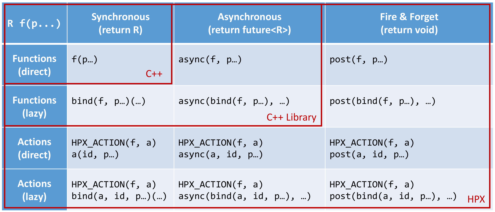

..
    Copyright (C) 2017 Antoine Tran Tan
    Copyright (C) 2007-2015 Hartmut Kaiser
    Copyright (C) 2012 Bryce Adelstein-Lelbach

    SPDX-License-Identifier: BSL-1.0
    Distributed under the Boost Software License, Version 1.0. (See accompanying
    file LICENSE_1_0.txt or copy at http://www.boost.org/LICENSE_1_0.txt)

.. _writing_distributed_hpx_applications:

======================================
Writing distributed |hpx| applications
======================================

This section focuses on the features of |hpx| needed to write distributed
applications, namely the :term:`Active Global Address Space` (:term:`AGAS`),
remotely executable functions (i.e. :term:`actions <action>`), and distributed
objects (i.e. :term:`components <component>`).

.. _global_names:

Global names
============

|hpx| implements an :term:`Active Global Address Space` (:term:`AGAS`) which is
exposing a single uniform address space spanning all localities an application
runs on. :term:`AGAS` is a fundamental component of the ParalleX execution
model. Conceptually, there is no rigid demarcation of local or global memory in
:term:`AGAS`; all available memory is a part of the same address space.
:term:`AGAS` enables named objects to be moved (migrated) across localities
without having to change the object's name, i.e., no references to migrated
objects have to be ever updated. This feature has significance for dynamic load
balancing and in applications where the workflow is highly dynamic, allowing
work to be migrated from heavily loaded nodes to less loaded nodes. In addition,
immutability of names ensures that :term:`AGAS` does not have to keep extra
indirections ("bread crumbs") when objects move, hence minimizing complexity of
code management for system developers as well as minimizing overheads in
maintaining and managing aliases.

The :term:`AGAS` implementation in |hpx| does not automatically expose every
local address to the global address space. It is the responsibility of the
programmer to explicitly define which of the objects have to be globally visible
and which of the objects are purely local.

In |hpx| global addresses (global names) are represented using the
``hpx::id_type`` data type. This data type is conceptually very similar to
``void*`` pointers as it does not expose any type information of the object it
is referring to.

The only predefined global addresses are assigned to all localities. The
following |hpx| API functions allow one to retrieve the global addresses of
localities:

* :cpp:func:`hpx::find_here`: retrieve the global address of the
  :term:`locality` this function is called on.
* :cpp:func:`hpx::find_all_localities()`: retrieve the global addresses of all
  localities available to this application (including the :term:`locality` the
  function is being called on).
* :cpp:func:`hpx::find_remote_localities()`: retrieve the global addresses of
  all remote localities available to this application (not including the
  :term:`locality` the function is being called on)
* :cpp:func:`hpx::get_num_localities()`: retrieve the number of localities
  available to this application.
* :cpp:func:`hpx::find_locality()`: retrieve the global address of any
  :term:`locality` supporting the given component type.
* :cpp:func:`hpx::get_colocation_id()`: retrieve the global address of the
  :term:`locality` currently hosting the object with the given global address.

Additionally, the global addresses of localities can be used to create new
instances of components using the following |hpx| API function:

* :cpp:func:`hpx::components::new_()`: Create a new instance of the given
  ``Component`` type on the specified :term:`locality`.

.. note::

   |hpx| does not expose any functionality to delete component instances. All
   global addresses (as represented using ``hpx::id_type``) are automatically
   garbage collected. When the last (global) reference to a particular component
   instance goes out of scope the corresponding component instance is
   automatically deleted.

.. _applying_actions:

Applying actions
================

.. _action_type_definition:

Action type definition
----------------------

Actions are special types we use to describe possibly remote operations. For
every global function and every member function which has to be invoked
distantly, a special type must be defined. For any global function the special
macro :c:macro:`HPX_PLAIN_ACTION` can be used to define the
action type. Here is an example demonstrating this::

    namespace app
    {
        void some_global_function(double d)
        {
            cout << d;
        }
    }

    // This will define the action type 'some_global_action' which represents
    // the function 'app::some_global_function'.
    HPX_PLAIN_ACTION(app::some_global_function, some_global_action);

.. important::

   The macro :c:macro:`HPX_PLAIN_ACTION` has to be placed in
   global namespace, even if the wrapped function is located in some other
   namespace. The newly defined action type is placed in the global namespace as
   well.

If the action type should be defined somewhere not in global namespace, the
action type definition has to be split into two macro invocations
(:c:macro:`HPX_DEFINE_PLAIN_ACTION` and :c:macro:`HPX_REGISTER_ACTION`) as shown
in the next example::

    namespace app
    {
        void some_global_function(double d)
        {
            cout << d;
        }

        // On conforming compilers the following macro expands to:
        //
        //    typedef hpx::actions::make_action<
        //        decltype(&some_global_function), &some_global_function
        //    >::type some_global_action;
        //
        // This will define the action type 'some_global_action' which represents
        // the function 'some_global_function'.
        HPX_DEFINE_PLAIN_ACTION(some_global_function, some_global_action);
    }

    // The following macro expands to a series of definitions of global objects
    // which are needed for proper serialization and initialization support
    // enabling the remote invocation of the function``some_global_function``
    HPX_REGISTER_ACTION(app::some_global_action, app_some_global_action);

The shown code defines an action type ``some_global_action`` inside the namespace
``app``.

.. important::

   If the action type definition is split between two macros as shown above, the
   name of the action type to create has to be the same for both macro
   invocations (here ``some_global_action``).

.. important::

   The second argument passed to :c:macro:`HPX_REGISTER_ACTION` (``app_some_global_action``) has
   to comprise a globally unique C++ identifier representing the action. This is
   used for serialization purposes.

For member functions of objects which have been registered with :term:`AGAS`
(e.g. 'components') a different registration macro
:c:macro:`HPX_DEFINE_COMPONENT_ACTION` has to be utilized. Any component needs
to be declared in a header file and have some special support macros defined in
a source file. Here is an example demonstrating this. The first snippet has to
go into the header file::

    namespace app
    {
        struct some_component
          : hpx::components::component_base<some_component>
        {
            int some_member_function(std::string s)
            {
                return boost::lexical_cast<int>(s);
            }

            // This will define the action type 'some_member_action' which
            // represents the member function 'some_member_function' of the
            // object type 'some_component'.
            HPX_DEFINE_COMPONENT_ACTION(some_component, some_member_function,
                some_member_action);
        };
    }

    // Note: The second argument to the macro below has to be systemwide-unique
    //       C++ identifiers
    HPX_REGISTER_ACTION_DECLARATION(app::some_component::some_member_action, some_component_some_action);

The next snippet belongs into a source file (e.g. the main application source
file) in the simplest case::

    typedef hpx::components::component<app::some_component> component_type;
    typedef app::some_component some_component;

    HPX_REGISTER_COMPONENT(component_type, some_component);

    // The parameters for this macro have to be the same as used in the corresponding
    // HPX_REGISTER_ACTION_DECLARATION() macro invocation above
    typedef some_component::some_member_action some_component_some_action;
    HPX_REGISTER_ACTION(some_component_some_action);

Granted, these macro invocations are a bit more complex than for simple global
functions, however we believe they are still manageable.

The most important macro invocation is the :c:macro:`HPX_DEFINE_COMPONENT_ACTION` in the header file
as this defines the action type we need to invoke the member function. For a
complete example of a simple component action see [hpx_link
examples/quickstart/component_in_executable.cpp..component_in_executable.cpp]

.. _action_invocation:

Action invocation
-----------------

The process of invoking a global function (or a member function of an object)
with the help of the associated action is called 'applying the action'. Actions
can have arguments, which will be supplied while the action is applied. At the
minimum, one parameter is required to apply any action - the id of the
:term:`locality` the associated function should be invoked on (for global
functions), or the id of the component instance (for member functions).
Generally, |hpx| provides several ways to apply an action, all of which are
described in the following sections.

Generally, |hpx| actions are very similar to 'normal' C++ functions except that
actions can be invoked remotely. :numref:`figure_hpx_the_api` below shows an
overview of the main API exposed by HPX. This shows the function invocation
syntax as defined by the C++ language (dark gray), the additional invocation
syntax as provided through C++ Standard Library features (medium gray), and the
extensions added by |hpx| (light gray) where:

* ``f`` function to invoke,
* ``p..``: (optional) arguments,
* ``R``: return type of ``f``,
* ``action``: action type defined by, :c:macro:`HPX_DEFINE_PLAIN_ACTION` or
  :c:macro:`HPX_DEFINE_COMPONENT_ACTION` encapsulating ``f``,
* ``a``: an instance of the type ```action``,
* ``id``: the global address the action is applied to.

.. _figure_hpx_the_api:



   Overview of the main API exposed by |hpx|.

This figure shows that |hpx| allows the user to apply actions with a syntax
similar to the C++ standard. In fact, all action types have an overloaded
function operator allowing to synchronously apply the action. Further, |hpx|
implements ``hpx::async`` which semantically works similar to the
way ``std::async`` works for plain C++ function.

.. note::

   The similarity of applying an action to conventional function invocations
   extends even further. |hpx| implements ``hpx::bind`` and ``hpx::function``
   two facilities which are semantically equivalent to the ``std::bind`` and
   ``std::function`` types as defined by the C++11 Standard. While
   ``hpx::async`` extends beyond the conventional semantics by supporting
   actions and conventional C++ functions, the |hpx| facilities ``hpx::bind``
   and ``hpx::function`` extend beyond the conventional standard facilities too.
   The |hpx| facilities not only support conventional functions, but can be used
   for actions as well.

Additionally, |hpx| exposes ``hpx::apply`` and ``hpx::async_continue`` both of
which refine and extend the standard C++ facilities.

The different ways to invoke a function in |hpx| will be explained in more
detail in the following sections.

.. _apply:

Applying an action asynchronously without any synchronization
-------------------------------------------------------------

This method ('fire and forget') will make sure the function associated with the
action is scheduled to run on the target :term:`locality`. Applying the action
does not wait for the function to start running, instead it is a fully
asynchronous operation. The following example shows how to apply the action as
defined :ref:`in the previous section <action_type_definition>` on the local
:term:`locality` (the :term:`locality` this code runs on)::

    some_global_action act;     // define an instance of some_global_action
    hpx::apply(act, hpx::find_here(), 2.0);

(the function ``hpx::find_here()`` returns the id of the local :term:`locality`,
i.e. the :term:`locality` this code executes on).

Any component member function can be invoked using the same syntactic construct.
Given that ``id`` is the global address for a component instance created
earlier, this invocation looks like::

    some_component_action act;     // define an instance of some_component_action
    hpx::apply(act, id, "42");

In this case any value returned from this action (e.g. in this case the integer
``42`` is ignored. Please look at :ref:`action_type_definition` for the code
defining the component action ``some_component_action`` used.

.. _async:

Applying an action asynchronously with synchronization
------------------------------------------------------

This method will make sure the action is scheduled to run on the target
:term:`locality`. Applying the action itself does not wait for the function to
start running or to complete, instead this is a fully asynchronous operation
similar to using ``hpx::apply`` as described above. The difference is that this
method will return an instance of a ``hpx::future<>`` encapsulating the result
of the (possibly remote) execution. The future can be used to synchronize with
the asynchronous operation. The following example shows how to apply the action
from above on the local :term:`locality`::

    some_global_action act;     // define an instance of some_global_action
    hpx::future<void> f = hpx::async(act, hpx::find_here(), 2.0);
    //
    // ... other code can be executed here
    //
    f.get();    // this will possibly wait for the asynchronous operation to 'return'

(as before, the function ``hpx::find_here()`` returns the id of the local
:term:`locality` (the :term:`locality` this code is executed on).

.. note::

   The use of a ``hpx::future<void>`` allows the current thread to synchronize
   with any remote operation not returning any value.

.. note::

   Any ``std::future<>`` returned from ``std::async()`` is required to block in
   its destructor if the value has not been set for this future yet. This is not
   true for ``hpx::future<>`` which will never block in its destructor, even if
   the value has not been returned to the future yet. We believe that
   consistency in the behavior of futures is more important than standards
   conformance in this case.

Any component member function can be invoked using the same syntactic construct.
Given that ``id`` is the global address for a component instance created
earlier, this invocation looks like::

    some_component_action act;     // define an instance of some_component_action
    hpx::future<int> f = hpx::async(act, id, "42");
    //
    // ... other code can be executed here
    //
    cout << f.get();    // this will possibly wait for the asynchronous operation to 'return' 42

.. note::

   The invocation of ``f.get()`` will return the result immediately (without
   suspending the calling thread) if the result from the asynchronous operation
   has already been returned. Otherwise, the invocation of ``f.get()`` will
   suspend the execution of the calling thread until the asynchronous operation
   returns its result.

.. _sync:

Applying an action synchronously
--------------------------------

This method will schedule the function wrapped in the specified action on the
target :term:`locality`. While the invocation appears to be synchronous (as we
will see), the calling thread will be suspended while waiting for the function
to return. Invoking a plain action (e.g. a global function) synchronously is
straightforward::

    some_global_action act;     // define an instance of some_global_action
    act(hpx::find_here(), 2.0);

While this call looks just like a normal synchronous function invocation, the
function wrapped by the action will be scheduled to run on a new thread and the
calling thread will be suspended. After the new thread has executed the wrapped
global function, the waiting thread will resume and return from the synchronous
call.

Equivalently, any action wrapping a component member function can be invoked
synchronously as follows::

    some_component_action act;     // define an instance of some_component_action
    int result = act(id, "42");

The action invocation will either schedule a new thread locally to execute the
wrapped member function (as before, ``id`` is the global address of the
component instance the member function should be invoked on), or it will send a
parcel to the remote :term:`locality` of the component causing a new thread to
be scheduled there. The calling thread will be suspended until the function
returns its result. This result will be returned from the synchronous action
invocation.

It is very important to understand that this 'synchronous' invocation syntax in
fact conceals an asynchronous function call. This is beneficial as the calling
thread is suspended while waiting for the outcome of a potentially remote
operation. The |hpx| thread scheduler will schedule other work in the meantime,
allowing the application to make further progress while the remote result is
computed. This helps overlapping computation with communication and hiding
communication latencies.

.. note::

   The syntax of applying an action is always the same, regardless whether the
   target :term:`locality` is remote to the invocation :term:`locality` or not.
   This is a very important feature of |hpx| as it frees the user from the task
   of keeping track what actions have to be applied locally and which actions
   are remote. If the target for applying an action is local, a new thread is
   automatically created and scheduled. Once this thread is scheduled and run,
   it will execute the function encapsulated by that action. If the target is
   remote, |hpx| will send a parcel to the remote :term:`locality` which
   encapsulates the action and its parameters. Once the parcel is received on
   the remote :term:`locality` |hpx| will create and schedule a new thread
   there. Once this thread runs on the remote :term:`locality`, it will execute
   the function encapsulated by the action.

.. _async_continue:

Applying an action with a continuation but without any synchronization
----------------------------------------------------------------------

This method is very similar to the method described in section :ref:`apply`. The
difference is that it allows the user to chain a sequence of asynchronous
operations, while handing the (intermediate) results from one step to the next
step in the chain. Where ``hpx::apply`` invokes a single function using 'fire
and forget' semantics, ``hpx::apply_continue`` asynchronously triggers a chain
of functions without the need for the execution flow 'to come back' to the
invocation site. Each of the asynchronous functions can be executed on a
different :term:`locality`.

.. _apply_continue:

Applying an action with a continuation and with synchronization
---------------------------------------------------------------

This method is very similar to the method described in section :ref:`async`. In
addition to what ``hpx::async`` can do, the functions ``hpx::async_continue``
takes an additional function argument. This function will be called as the
continuation of the executed action. It is expected to perform additional
operations and to make sure that a result is returned to the original invocation
site. This method chains operations asynchronously by providing a continuation
operation which is automatically executed once the first action has finished
executing.

As an example we chain two actions, where the result of the first action is
forwarded to the second action and the result of the second action is sent back
to the original invocation site::

    // first action
    std::int32_t action1(std::int32_t i)
    {
        return i+1;
    }
    HPX_PLAIN_ACTION(action1);    // defines action1_type

    // second action
    std::int32_t action2(std::int32_t i)
    {
        return i*2;
    }
    HPX_PLAIN_ACTION(action2);    // defines action2_type

    // this code invokes 'action1' above and passes along a continuation
    // function which will forward the result returned from 'action1' to
    // 'action2'.
    action1_type act1;     // define an instance of 'action1_type'
    action2_type act2;     // define an instance of 'action2_type'
    hpx::future<int> f =
        hpx::async_continue(act1, hpx::make_continuation(act2),
            hpx::find_here(), 42);
    hpx::cout << f.get() << "\n";   // will print: 86 ((42 + 1) * 2)

By default, the continuation is executed on the same :term:`locality` as
``hpx::async_continue`` is invoked from. If you want to specify the
:term:`locality` where the continuation should be executed, the code above has
to be written as::

    // this code invokes 'action1' above and passes along a continuation
    // function which will forward the result returned from 'action1' to
    // 'action2'.
    action1_type act1;     // define an instance of 'action1_type'
    action2_type act2;     // define an instance of 'action2_type'
    hpx::future<int> f =
        hpx::async_continue(act1, hpx::make_continuation(act2, hpx::find_here()),
            hpx::find_here(), 42);
    hpx::cout << f.get() << "\n";   // will print: 86 ((42 + 1) * 2)

Similarly, it is possible to chain more than 2 operations::

    action1_type act1;     // define an instance of 'action1_type'
    action2_type act2;     // define an instance of 'action2_type'
    hpx::future<int> f =
        hpx::async_continue(act1,
            hpx::make_continuation(act2, hpx::make_continuation(act1)),
            hpx::find_here(), 42);
    hpx::cout << f.get() << "\n";   // will print: 87 ((42 + 1) * 2 + 1)

The function ``hpx::make_continuation`` creates a special function object
which exposes the following prototype::

    struct continuation
    {
        template <typename Result>
        void operator()(hpx::id_type id, Result&& result) const
        {
            ...
        }
    };

where the parameters passed to the overloaded function operator ``operator()()``
are:

* the ``id`` is the global id where the final result of the asynchronous chain
  of operations should be sent to (in most cases this is the id of the
  ``hpx::future`` returned from the initial call to ``hpx::async_continue``. Any
  custom continuation function should make sure this ``id`` is forwarded to the
  last operation in the chain.
* the ``result`` is the result value of the current operation in the
  asynchronous execution chain. This value needs to be forwarded to the next
  operation.

.. note::

   All of those operations are implemented by the predefined continuation
   function object which is returned from ``hpx::make_continuation``. Any (custom)
   function object used as a continuation should conform to the same interface.

.. _action_error_handling:

Action error handling
---------------------

Like in any other asynchronous invocation scheme it is important to be able to
handle error conditions occurring while the asynchronous (and possibly remote)
operation is executed. In |hpx| all error handling is based on standard C++
exception handling. Any exception thrown during the execution of an asynchronous
operation will be transferred back to the original invocation :term:`locality`,
where it is rethrown during synchronization with the calling thread.

.. important::

   Exceptions thrown during asynchronous execution can be transferred back to
   the invoking thread only for the synchronous and the asynchronous case with
   synchronization. Like with any other unhandled exception, any exception
   thrown during the execution of an asynchronous action *without*
   synchronization will result in calling ``hpx::terminate`` causing the running
   application to exit immediately.

.. note::

   Even if error handling internally relies on exceptions, most of the API
   functions exposed by |hpx| can be used without throwing an exception. Please
   see :ref:`exceptions` for more information.

As an example, we will assume that the following remote function will be
executed::

    namespace app
    {
        void some_function_with_error(int arg)
        {
            if (arg < 0) {
                HPX_THROW_EXCEPTION(bad_parameter, "some_function_with_error",
                    "some really bad error happened");
            }
            // do something else...
        }
    }

    // This will define the action type 'some_error_action' which represents
    // the function 'app::some_function_with_error'.
    HPX_PLAIN_ACTION(app::some_function_with_error, some_error_action);

The use of :c:macro:`HPX_THROW_EXCEPTION` to report the error encapsulates the
creation of a :cpp:class:`hpx::exception` which is initialized with the error
code ``hpx::bad_parameter``. Additionally it carries the passed strings, the
information about the file name, line number, and call stack of the point the
exception was thrown from.

We invoke this action using the synchronous syntax as described before::

    // note: wrapped function will throw hpx::exception
    some_error_action act;            // define an instance of some_error_action
    try {
        act(hpx::find_here(), -3);    // exception will be rethrown from here
    }
    catch (hpx::exception const& e) {
        // prints: 'some really bad error happened: HPX(bad parameter)'
        cout << e.what();
    }

If this action is invoked asynchronously with synchronization, the exception is
propagated to the waiting thread as well and is re-thrown from the future's
function ``get()``::

    // note: wrapped function will throw hpx::exception
    some_error_action act;            // define an instance of some_error_action
    hpx::future<void> f = hpx::async(act, hpx::find_here(), -3);
    try {
        f.get();                      // exception will be rethrown from here
    }
    catch (hpx::exception const& e) {
        // prints: 'some really bad error happened: HPX(bad parameter)'
        cout << e.what();
    }

For more information about error handling please refer to the section
:ref:`exceptions`. There we also explain how to handle error conditions without
having to rely on exception.

.. _components:

Writing components
==================

A component in |hpx| is a C++ class which can be created remotely and for which
its member functions can be invoked remotely as well. The following sections
highlight how components can be defined, created, and used.

.. _components_server:

Defining components
-------------------

In order for a C++ class type to be managed remotely in |hpx|, the type must be
derived from the ``hpx::components::component_base`` template type. We
call such C++ class types 'components'.

Note that the component type itself is passed as a template argument to the base
class::

    // header file some_component.hpp

    #include <hpx/include/components.hpp>

    namespace app
    {
        // Define a new component type 'some_component'
        struct some_component
          : hpx::components::component_base<some_component>
        {
            // This member function is has to be invoked remotely
            int some_member_function(std::string const& s)
            {
                return boost::lexical_cast<int>(s);
            }

            // This will define the action type 'some_member_action' which
            // represents the member function 'some_member_function' of the
            // object type 'some_component'.
            HPX_DEFINE_COMPONENT_ACTION(some_component, some_member_function, some_member_action);
        };
    }

    // This will generate the necessary boiler-plate code for the action allowing
    // it to be invoked remotely. This declaration macro has to be placed in the
    // header file defining the component itself.
    //
    // Note: The second argument to the macro below has to be systemwide-unique
    //       C++ identifiers
    //
    HPX_REGISTER_ACTION_DECLARATION(app::some_component::some_member_action, some_component_some_action);

There is more boiler plate code which has to be placed into a source file in
order for the component to be usable. Every component type is required to have
macros placed into its source file, one for each component type and one macro
for each of the actions defined by the component type.

For instance::

    // source file some_component.cpp

    #include "some_component.hpp"

    // The following code generates all necessary boiler plate to enable the
    // remote creation of 'app::some_component' instances with 'hpx::new_<>()'
    //
    using some_component = app::some_component;
    using some_component_type = hpx::components::component<some_component>;

    // Please note that the second argument to this macro must be a
    // (system-wide) unique C++-style identifier (without any namespaces)
    //
    HPX_REGISTER_COMPONENT(some_component_type, some_component);

    // The parameters for this macro have to be the same as used in the corresponding
    // HPX_REGISTER_ACTION_DECLARATION() macro invocation in the corresponding
    // header file.
    //
    // Please note that the second argument to this macro must be a
    // (system-wide) unique C++-style identifier (without any namespaces)
    //
    HPX_REGISTER_ACTION(app::some_component::some_member_action, some_component_some_action);

.. _components_client:

Defining client side representation classes
-------------------------------------------

Often it is very convenient to define a separate type for a component which can
be used on the client side (from where the component is instantiated and used).
This step might seem as unnecessary duplicating code, however it significantly
increases the type safety of the code.

A possible implementation of such a client side representation for the component
described in the previous section could look like::

    #include <hpx/include/components.hpp>

    namespace app
    {
        // Define a client side representation type for the component type
        // 'some_component' defined in the previous section.
        //
        struct some_component_client
          : hpx::components::client_base<some_component_client, some_component>
        {
            using base_type = hpx::components::client_base<
                    some_component_client, some_component>;

            some_component_client(hpx::future<hpx::id_type> && id)
              : base_type(std::move(id))
            {}

            hpx::future<int> some_member_function(std::string const& s)
            {
                some_component::some_member_action act;
                return hpx::async(act, get_id(), s);
            }
        };
    }

A client side object stores the global id of the component instance it
represents. This global id is accessible by calling the function
``client_base<>::get_id()``. The special constructor which is provided in the
example allows to create this client side object directly using the API function
:cpp:func:`hpx::new_`.

.. _create_components:

Creating component instances
----------------------------

Instances of defined component types can be created in two different ways. If
the component to create has a defined client side representation type, then this
can be used, otherwise use the server type.

The following examples assume that ``some_component_type`` is the type of the
server side implementation of the component to create. All additional arguments
(see ``, ...`` notation below) are passed through to the corresponding
constructor calls of those objects::

    // create one instance on the given locality
    hpx::id_type here = hpx::find_here();
    hpx::future<hpx::id_type> f =
        hpx::new_<some_component_type>(here, ...);

    // create one instance using the given distribution
    // policy (here: hpx::colocating_distribution_policy)
    hpx::id_type here = hpx::find_here();
    hpx::future<hpx::id_type> f =
        hpx::new_<some_component_type>(hpx::colocated(here), ...);

    // create multiple instances on the given locality
    hpx::id_type here = find_here();
    hpx::future<std::vector<hpx::id_type>> f =
        hpx::new_<some_component_type[]>(here, num, ...);

    // create multiple instances using the given distribution
    // policy (here: hpx::binpacking_distribution_policy)
    hpx::future<std::vector<hpx::id_type>> f = hpx::new_<some_component_type[]>(
        hpx::binpacking(hpx::find_all_localities()), num, ...);

The examples below demonstrate the use of the same API functions for creating
client side representation objects (instead of just plain ids). These examples
assume that ``client_type`` is the type of the client side representation of the
component type to create. As above, all additional arguments
(see ``, ...`` notation below) are passed through to the corresponding constructor
calls of the server side implementation objects corresponding to the
``client_type``::

    // create one instance on the given locality
    hpx::id_type here = hpx::find_here();
    client_type c = hpx::new_<client_type>(here, ...);

    // create one instance using the given distribution
    // policy (here: hpx::colocating_distribution_policy)
    hpx::id_type here = hpx::find_here();
    client_type c = hpx::new_<client_type>(hpx::colocated(here), ...);

    // create multiple instances on the given locality
    hpx::id_type here = hpx::find_here();
    hpx::future<std::vector<client_type>> f =
        hpx::new_<client_type[]>(here, num, ...);

    // create multiple instances using the given distribution
    // policy (here: hpx::binpacking_distribution_policy)
    hpx::future<std::vector<client_type>> f = hpx::new_<client_type[]>(
        hpx::binpacking(hpx::find_all_localities()), num, ...);

.. _use_components:

Using component instances
-------------------------

.. _containers:

Segmented containers
====================

In parallel programming, there is now a plethora of solutions aimed at
implementing "partially contiguous" or segmented data structures, whether on
shared memory systems or distributed memory systems. |hpx| implements such
structures by drawing inspiration from Standard C++ containers.

.. _parallel_containers:

Using segmented containers
--------------------------

A segmented container is a template class that is described in the namespace
``hpx``. All segmented containers are very similar semantically to their
sequential counterpart (defined in ``namespace std`` but with an additional
template parameter named ``DistPolicy``). The distribution policy is an optional
parameter that is passed last to the segmented container constructor (after the
container size when no default value is given, after the default value if not).
The distribution policy describes the manner in which a container is segmented
and the placement of each segment among the available runtime localities.

However, only a part of the ``std`` container member functions were
reimplemented:

* ``(constructor)``, ``(destructor)``, ``operator=``
* ``operator[]``
* ``begin``, ``cbegin``, ``end``, ``cend``
* ``size``

An example of how to use the ``partitioned_vector`` container would be::

    #include <hpx/include/partitioned_vector.hpp>

    // The following code generates all necessary boiler plate to enable the
    // remote creation of 'partitioned_vector' segments
    //
    HPX_REGISTER_PARTITIONED_VECTOR(double);

    // By default, the number of segments is equal to the current number of
    // localities
    //
    hpx::partitioned_vector<double> va(50);
    hpx::partitioned_vector<double> vb(50, 0.0);

An example of how to use the ``partitioned_vector`` container
with distribution policies would be::

    #include <hpx/include/partitioned_vector.hpp>
    #include <hpx/runtime/find_localities.hpp>

    // The following code generates all necessary boiler plate to enable the
    // remote creation of 'partitioned_vector' segments
    //
    HPX_REGISTER_PARTITIONED_VECTOR(double);

    std::size_t num_segments = 10;
    std::vector<hpx::id_type> locs = hpx::find_all_localities()

    auto layout =
            hpx::container_layout( num_segments, locs );

    // The number of segments is 10 and those segments are spread across the
    // localities collected in the variable locs in a Round-Robin manner
    //
    hpx::partitioned_vector<double> va(50, layout);
    hpx::partitioned_vector<double> vb(50, 0.0, layout);

By definition, a segmented container must be accessible from any thread although
its construction is synchronous only for the thread who has called its
constructor. To overcome this problem, it is possible to assign a symbolic name
to the segmented container::

    #include <hpx/include/partitioned_vector.hpp>

    // The following code generates all necessary boiler plate to enable the
    // remote creation of 'partitioned_vector' segments
    //
    HPX_REGISTER_PARTITIONED_VECTOR(double);

    hpx::future<void> fserver = hpx::async(
      [](){
        hpx::partitioned_vector<double> v(50);

        // Register the 'partitioned_vector' with the name "some_name"
        //
        v.register_as("some_name");

        /* Do some code  */
      });

    hpx::future<void> fclient =
      hpx::async(
        [](){
          // Naked 'partitioned_vector'
          //
          hpx::partitioned_vector<double> v;

          // Now the variable v points to the same 'partitioned_vector' that has
          // been registered with the name "some_name"
          //
          v.connect_to("some_name");

          /* Do some code  */
        });

Segmented containers
....................

|hpx| provides the following segmented containers:

.. list-table:: Sequence containers

   * * Name
     * Description
     * In header
     * Class page at cppreference.com
   * * ``hpx::partitioned_vector``
     * Dynamic segmented contiguous array.
     * ``<hpx/include/partitioned_vector.hpp>``
     * :cppreference-container:`vector`

.. list-table:: Unordered associative containers

   * * Name
     * Description
     * In header
     * Class page at cppreference.com
   * * ``hpx::unordered_map``
     * Segmented collection of key-value pairs, hashed by keys, keys are unique.
     * ``<hpx/include/unordered_map.hpp>``
     * :cppreference-container:`unordered_map`

.. _segmented_iterators:

Segmented iterators and segmented iterator traits
-------------------------------------------------

The basic iterator used in the STL library is only suitable for one-dimensional
structures. The iterators we use in |hpx| must adapt to the segmented format of
our containers. Our iterators are then able to know when incrementing themselves
if the next element of type ``T`` is in the same data segment or in another
segment. In this second case, the iterator will automatically point to the
beginning of the next segment.

.. note::

   Note that the dereference operation ``operator *`` does not directly return a
   reference of type ``T&`` but an intermediate object wrapping this reference.
   When this object is used as an l-value, a remote write operation is
   performed; When this object is used as an r-value, implicit conversion to
   ``T`` type will take care of performing remote read operation.

It is sometimes useful not only to iterate element by element, but also segment
by segment, or simply get a local iterator in order to avoid additional
construction costs at each deferencing operations. To mitigate this need, the
:cpp:class:`hpx::traits::segmented_iterator_traits` are used.

With ``segmented_iterator_traits`` users can uniformly get the iterators
which specifically iterates over segments (by providing a segmented iterator
as a parameter), or get the local begin/end iterators of the nearest
local segment (by providing a per-segment iterator as a parameter)::

    #include <hpx/include/partitioned_vector.hpp>

    // The following code generates all necessary boiler plate to enable the
    // remote creation of 'partitioned_vector' segments
    //
    HPX_REGISTER_PARTITIONED_VECTOR(double);

    using iterator = hpx::partitioned_vector<T>::iterator;
    using traits   = hpx::traits::segmented_iterator_traits<iterator>;

    hpx::partitioned_vector<T> v;
    std::size_t count = 0;

    auto seg_begin = traits::segment(v.begin());
    auto seg_end   = traits::segment(v.end());

    // Iterate over segments
    for (auto seg_it = seg_begin; seg_it != seg_end; ++seg_it)
    {
        auto loc_begin = traits::begin(seg_it);
        auto loc_end   = traits::end(seg_it);

        // Iterate over elements inside segments
        for (auto lit = loc_begin; lit != loc_end; ++lit, ++count)
        {
            *lit = count;
        }
    }

Which is equivalent to::

    hpx::partitioned_vector<T> v;
    std::size_t count = 0;

    auto begin = v.begin();
    auto end   = v.end();

    for (auto it = begin; it != end; ++it, ++count)
    {
        *it = count;
    }

.. _partitioned_vector_views:

Using views
-----------

The use of multidimensional arrays is quite common in the numerical field
whether to perform dense matrix operations or to process images. It exist many
libraries which implement such object classes overloading their basic operators
(e.g.``+``, ``-``, ``*``, ``()``, etc.). However, such operation becomes more
delicate when the underlying data layout is segmented or when it is mandatory to
use optimized linear algebra subroutines (i.e. BLAS subroutines).

Our solution is thus to relax the level of abstraction by allowing the user to
work not directly on n-dimensionnal data, but on "n-dimensionnal collections of
1-D arrays". The use of well-accepted techniques on contiguous data is thus
preserved at the segment level, and the composability of the segments is made
possible thanks to multidimensional array-inspired access mode.

.. _spmd_block:

Preface: Why SPMD?
..................

Although |hpx| refutes by design this programming model, the :term:`locality`
plays a dominant role when it comes to implement vectorized code. To maximize
local computations and avoid unneeded data transfers, a parallel section (or
Single Programming Multiple Data section) is required. Because the use of global
variables is prohibited, this parallel section is created via the RAII idiom.

To define a parallel section, simply write an action taking a ``spmd_block``
variable as a first parameter::

    #include <hpx/collectives/spmd_block.hpp>

    void bulk_function(hpx::lcos::spmd_block block /* , arg0, arg1, ... */)
    {
        // Parallel section

        /* Do some code */
    }
    HPX_PLAIN_ACTION(bulk_function, bulk_action);

.. note::

   In the following paragraphs, we will use the term "image" several times. An
   image is defined as a lightweight process whose entry point is a function
   provided by the user. It's an "image of the function".

The ``spmd_block`` class contains the following methods:

* [def Team information] ``get_num_images``, ``this_image``, ``images_per_locality``
* [def Control statements] ``sync_all``, ``sync_images``

Here is a sample code summarizing the features offered by the ``spmd_block``
class::

    #include <hpx/collectives/spmd_block.hpp>

    void bulk_function(hpx::lcos::spmd_block block /* , arg0, arg1, ... */)
    {
        std::size_t num_images = block.get_num_images();
        std::size_t this_image = block.this_image();
        std::size_t images_per_locality = block.images_per_locality();

        /* Do some code */

        // Synchronize all images in the team
        block.sync_all();

        /* Do some code */

        // Synchronize image 0 and image 1
        block.sync_images(0,1);

        /* Do some code */

        std::vector<std::size_t> vec_images = {2,3,4};

        // Synchronize images 2, 3 and 4
        block.sync_images(vec_images);

        // Alternative call to synchronize images 2, 3 and 4
        block.sync_images(vec_images.begin(), vec_images.end());

        /* Do some code */

        // Non-blocking version of sync_all()
        hpx::future<void> event =
            block.sync_all(hpx::launch::async);

        // Callback waiting for 'event' to be ready before being scheduled
        hpx::future<void> cb =
            event.then(
              [](hpx::future<void>)
              {

                /* Do some code */

              });

        // Finally wait for the execution tree to be finished
        cb.get();
    }
    HPX_PLAIN_ACTION(bulk_test_function, bulk_test_action);

Then, in order to invoke the parallel section, call the function
``define_spmd_block`` specifying an arbitrary symbolic name and indicating the
number of images per :term:`locality` to create::

    void bulk_function(hpx::lcos::spmd_block block, /* , arg0, arg1, ... */)
    {

    }
    HPX_PLAIN_ACTION(bulk_test_function, bulk_test_action);

    int main()
    {
        /* std::size_t arg0, arg1, ...; */

        bulk_action act;
        std::size_t images_per_locality = 4;

        // Instantiate the parallel section
        hpx::lcos::define_spmd_block(
            "some_name", images_per_locality, std::move(act) /*, arg0, arg1, ... */);

        return 0;
    }

.. note::

   In principle, the user should never call the ``spmd_block`` constructor. The
   ``define_spmd_block`` function is responsible of instantiating ``spmd_block``
   objects and broadcasting them to each created image.

.. _spmd_views:

SPMD multidimensional views
...........................

Some classes are defined as "container views" when the purpose is to observe
and/or modify the values of a container using another perspective than the one
that characterizes the container. For example, the values of an ``std::vector``
object can be accessed via the expression ``[i]``. Container views can be used,
for example, when it is desired for those values to be "viewed" as a 2D matrix
that would have been flattened in a ``std::vector``. The values would be
possibly accessible via the expression ``vv(i,j)`` which would call internally
the expression ``v[k]``.

By default, the ``partitioned_vector`` class integrates 1-D views of its segments::

    #include <hpx/include/partitioned_vector.hpp>

    // The following code generates all necessary boiler plate to enable the
    // remote creation of 'partitioned_vector' segments
    //
    HPX_REGISTER_PARTITIONED_VECTOR(double);

    using iterator = hpx::partitioned_vector<double>::iterator;
    using traits   = hpx::traits::segmented_iterator_traits<iterator>;

    hpx::partitioned_vector<double> v;

    // Create a 1-D view of the vector of segments
    auto vv = traits::segment(v.begin());

    // Access segment i
    std::vector<double> v = vv[i];

Our views are called "multidimensional" in the sense that they generalize to N
dimensions the purpose of ``segmented_iterator_traits::segment()`` in the 1-D
case. Note that in a parallel section, the 2-D expression ``a(i,j) = b(i,j)`` is
quite confusing because without convention, each of the images invoked will race
to execute the statement. For this reason, our views are not only
multidimensional but also "spmd-aware".

.. note::

   SPMD-awareness: The convention is simple. If an assignment statement contains
   a view subscript as an l-value, it is only and only the image holding the
   r-value who is evaluating the statement. (In MPI sense, it is called a Put
   operation).

.. _subscripts:

Subscript-based operations
,,,,,,,,,,,,,,,,,,,,,,,,,,

Here are some examples of using subscripts in the 2-D view case::

    #include <hpx/components/containers/partitioned_vector/partitioned_vector_view.hpp>
    #include <hpx/include/partitioned_vector.hpp>

    // The following code generates all necessary boiler plate to enable the
    // remote creation of 'partitioned_vector' segments
    //
    HPX_REGISTER_PARTITIONED_VECTOR(double);

    using Vec = hpx::partitioned_vector<double>;
    using View_2D = hpx::partitioned_vector_view<double,2>;

    /* Do some code */

    Vec v;

    // Parallel section (suppose 'block' an spmd_block instance)
    {
        std::size_t height, width;

        // Instantiate the view
        View_2D vv(block, v.begin(), v.end(), {height,width});

        // The l-value is a view subscript, the image that owns vv(1,0)
        // evaluates the assignment.
        vv(0,1) = vv(1,0);

        // The l-value is a view subscript, the image that owns the r-value
        // (result of expression 'std::vector<double>(4,1.0)') evaluates the
        // assignment : oops! race between all participating images.
        vv(2,3) = std::vector<double>(4,1.0);
    }

.. _view_iterators:

Iterator-based operations
,,,,,,,,,,,,,,,,,,,,,,,,,

Here are some examples of using iterators in the 3-D view case::

    #include <hpx/components/containers/partitioned_vector/partitioned_vector_view.hpp>
    #include <hpx/include/partitioned_vector.hpp>

    // The following code generates all necessary boiler plate to enable the
    // remote creation of 'partitioned_vector' segments
    //
    HPX_REGISTER_PARTITIONED_VECTOR(int);

    using Vec = hpx::partitioned_vector<int>;
    using View_3D = hpx::partitioned_vector_view<int,3>;

    /* Do some code */

    Vec v1, v2;

    // Parallel section (suppose 'block' an spmd_block instance)
    {
        std::size_t sixe_x, size_y, size_z;

        // Instantiate the views
        View_3D vv1(block, v1.begin(), v1.end(), {sixe_x,size_y,size_z});
        View_3D vv2(block, v2.begin(), v2.end(), {sixe_x,size_y,size_z});

        // Save previous segments covered by vv1 into segments covered by vv2
        auto vv2_it = vv2.begin();
        auto vv1_it = vv1.cbegin();

        for(; vv2_it != vv2.end(); vv2_it++, vv1_it++)
        {
            // It's a Put operation
            *vv2_it = *vv1_it;
        }

        // Ensure that all images have performed their Put operations
        block.sync_all();

        // Ensure that only one image is putting updated data into the different
        // segments covered by vv1
        if(block.this_image() == 0)
        {
            int idx = 0;

            // Update all the segments covered by vv1
            for(auto i = vv1.begin(); i != vv1.end(); i++)
            {
                // It's a Put operation
                *i = std::vector<float>(elt_size,idx++);
            }
        }
    }

Here is an example that shows how to iterate only over segments
owned by the current image::

    #include <hpx/components/containers/partitioned_vector/partitioned_vector_view.hpp>
    #include <hpx/components/containers/partitioned_vector/partitioned_vector_local_view.hpp>
    #include <hpx/include/partitioned_vector.hpp>

    // The following code generates all necessary boiler plate to enable the
    // remote creation of 'partitioned_vector' segments
    //
    HPX_REGISTER_PARTITIONED_VECTOR(float);

    using Vec = hpx::partitioned_vector<float>;
    using View_1D = hpx::partitioned_vector_view<float,1>;

    /* Do some code */

    Vec v;

    // Parallel section (suppose 'block' an spmd_block instance)
    {
        std::size_t num_segments;

        // Instantiate the view
        View_1D vv(block, v.begin(), v.end(), {num_segments});

        // Instantiate the local view from the view
        auto local_vv = hpx::local_view(vv);

        for ( auto i = local_vv.begin(); i != local_vv.end(); i++ )
        {
            std::vector<float> & segment = *i;

            /* Do some code */
        }

    }

.. _sub_views:

Instantiating sub-views
,,,,,,,,,,,,,,,,,,,,,,,

It is possible to construct views from other views: we call it sub-views. The
constraint nevertheless for the subviews is to retain the dimension and the
value type of the input view. Here is an example showing how to create a
sub-view::

    #include <hpx/components/containers/partitioned_vector/partitioned_vector_view.hpp>
    #include <hpx/include/partitioned_vector.hpp>

    // The following code generates all necessary boiler plate to enable the
    // remote creation of 'partitioned_vector' segments
    //
    HPX_REGISTER_PARTITIONED_VECTOR(float);

    using Vec = hpx::partitioned_vector<float>;
    using View_2D = hpx::partitioned_vector_view<float,2>;

    /* Do some code */

    Vec v;

    // Parallel section (suppose 'block' an spmd_block instance)
    {
        std::size_t N = 20;
        std::size_t tilesize = 5;

        // Instantiate the view
        View_2D vv(block, v.begin(), v.end(), {N,N});

        // Instantiate the subview
        View_2D svv(
            block,&vv(tilesize,0),&vv(2*tilesize-1,tilesize-1),{tilesize,tilesize},{N,N});

        if(block.this_image() == 0)
        {
            // Equivalent to 'vv(tilesize,0) = 2.0f'
            svv(0,0) = 2.0f;

            // Equivalent to 'vv(2*tilesize-1,tilesize-1) = 3.0f'
            svv(tilesize-1,tilesize-1) = 3.0f;
        }

    }

.. note::

   The last parameter of the subview constructor is the size of the original
   view. If one would like to create a subview of the subview and so on, this
   parameter should stay unchanged. ``{N,N}`` for the above example).

C++ co-arrays
-------------

Fortran has extended its scalar element indexing approach to reference each
segment of a distributed array. In this extension, a segment is attributed a
?co-index? and lives in a specific :term:`locality`. A co-index provides the
application with enough information to retrieve the corresponding data
reference. In C++, containers present themselves as a ?smarter? alternative of
Fortran arrays but there are still no corresponding standardized features
similar to the Fortran co-indexing approach. We present here an implementation
of such features in |hpx|.

Preface: co-array, a segmented container tied to a SPMD multidimensional views
..............................................................................

As mentioned before, a co-array is a distributed array whose segments are
accessible through an array-inspired access mode. We have previously seen that
it is possible to reproduce such access mode using the concept of views.
Nevertheless, the user must pre-create a segmented container to instantiate this
view. We illustrate below how a single constructor call can perform those two
operations::

    #include <hpx/components/containers/coarray/coarray.hpp>
    #include <hpx/collectives/spmd_block.hpp>

    // The following code generates all necessary boiler plate to enable the
    // co-creation of 'coarray'
    //
    HPX_REGISTER_COARRAY(double);

    // Parallel section (suppose 'block' an spmd_block instance)
    {
        using hpx::container::placeholders::_;

        std::size_t height=32, width=4, segment_size=10;

        hpx::coarray<double,3> a(block, "a", {height,width,_}, segment_size);

        /* Do some code */
    }

Unlike segmented containers, a co-array object can only be instantiated within a
parallel section. Here is the description of the parameters to provide to the
coarray constructor:

.. list-table:: Parameters of coarray constructor

   * * Parameter
     * Description
   * * ``block``
     * Reference to a ``spmd_block`` object
   * * ``"a"``
     * Symbolic name of type ``std::string``
   * * ``{height,width,_}``
     * Dimensions of the ``coarray`` object
   * * ``segment_size``
     * Size of a co-indexed element (i.e. size of the object referenced by the
       expression ``a(i,j,k)``)

Note that the "last dimension size" cannot be set by the user. It only accepts
the constexpr variable ``hpx::container::placeholders::_``. This size, which is
considered private, is equal to the number of current images (value returned by
``block.get_num_images()``).

.. note::

   An important constraint to remember about coarray objects is that all
   segments sharing the same "last dimension index" are located in the same
   image.

Using co-arrays
...............

The member functions owned by the ``coarray`` objects are exactly the same as
those of spmd multidimensional views. These are::

* Subscript-based operations
* Iterator-based operations

However, one additional functionality is provided. Knowing that the element
``a(i,j,k)`` is in the memory of the ``k``\ th image, the use of local subscripts
is possible.

.. note::

   For spmd multidimensional views, subscripts are only global as it still
   involves potential remote data transfers.

Here is an example of using local subscripts::

    #include <hpx/components/containers/coarray/coarray.hpp>
    #include <hpx/collectives/spmd_block.hpp>

    // The following code generates all necessary boiler plate to enable the
    // co-creation of 'coarray'
    //
    HPX_REGISTER_COARRAY(double);

    // Parallel section (suppose 'block' an spmd_block instance)
    {
        using hpx::container::placeholders::_;

        std::size_t height=32, width=4, segment_size=10;

        hpx::coarray<double,3> a(block, "a", {height,width,_}, segment_size);

        double idx = block.this_image()*height*width;

        for (std::size_t j = 0; j<width; j++)
        for (std::size_t i = 0; i<height; i++)
        {
            // Local write operation performed via the use of local subscript
            a(i,j,_) = std::vector<double>(elt_size,idx);
            idx++;
        }

        block.sync_all();
    }

.. note::

   When the "last dimension index" of a subscript is equal to
   ``hpx::container::placeholders::_``, local subscript (and not global
   subscript) is used. It is equivalent to a global subscript used with a "last
   dimension index" equal to the value returned by ``block.this_image()``.
